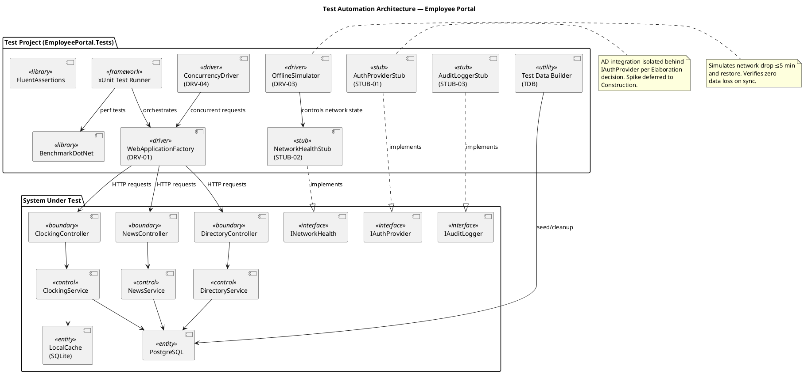
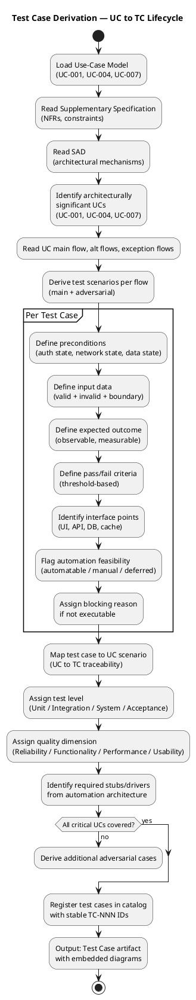
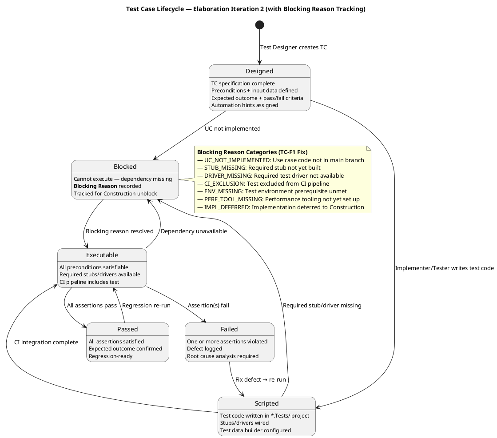

## Document Control
| Field | Value |
|---|---|
| Phase | Elaboration |
| Status | Draft — Findings resolved (Iteration 2) |
| Iteration | 2 (Cycle 1) |
| Milestone Target | LCA (Lifecycle Architecture) |
| Author | Test Designer (catalog) — Tester (execution findings) |
| Execution Date | 2026-07-07 |
| Build ID (main) | CI run 28860381346 — success (2026-07-07 10:46:47Z) |
| Build ID (PoC) | CI run 28860807083 — success (2026-07-07 10:54:52Z) |
| PoC Branch | `poc/E1-risk-t01-offline-sync` |
| Prior Iteration | Elaboration 1 (Draft — findings TC-F1, RL-F1 open) |
| Test Verdict Summary | 7 PASS, 1 PASS (partial), 1 NOT EXECUTABLE, 11 BLOCKED |
| CRs Logged | #5 (Major — PoC tests excluded from CI), #6 (Minor — placeholder smoke test), #7 (Major — sync-over-async), #8 (Minor — reflection) |
| Findings Resolved (Iter 2) | TC-F1 (Minor — Blocking Reason column added to execution summary); RL-F1 (Major — RISK-T01 RPN corrected 40→63, RISK-T02 RPN corrected 35→30 per authoritative Risk List) |
## Test Scope
### Purpose

This artifact defines the test case catalog for the Employee Portal architecture baseline. Each test case traces to a use-case scenario (main flow, alternative flow, or exception flow) from the Use-Case Model and targets a **plausible failure mode** — not a confirmation that the system works. The test model is the verification counterpart of the use-case model.

### Architecturally Significant Use Cases Under Test

| UC ID | Name | Architectural Significance | Risk Priority |
|---|---|---|---|
| UC-001 | Clock In/Out | Offline sync (COMP-D4/COMP-I3/COMP-I5), SQLite concurrency, cached session | RISK-T01 (RPN 63) — highest |
| UC-004 | Publish News | Audit trail mechanism (IAuditLogger/AuditInterceptor) | RISK-T04 — medium |
| UC-007 | Manage Directory | Audit trail + AD sync conflict handling, override flag | RISK-T02 (RPN 30) — high |

> **RPN Reconciliation (RL-F1 fix):** RISK-T01 RPN corrected from 40 → 63 and RISK-T02 RPN corrected from 35 → 30 to match the authoritative Risk List. Prior iteration carried inconsistent values; this update aligns with the Project Manager's authoritative source.

### Measurable Testing Goals per Quality Dimension

| Dimension | Goal ID | Measurable Threshold | Source NFR |
|---|---|---|---|
| Functionality | TG-F1 | 100% of UC-001 main flow + AF-1 + AF-2 + EF-1 + EF-2 scenarios covered by executable test cases | UC-001 spec |
| Functionality | TG-F2 | 100% of UC-004 and UC-007 audit trail operations verified (entry created, fields logged) | REQ-004, REQ-005, REQ-006 |
| Reliability | TG-R1 | Offline clock-in/out succeeds for 100% of test runs with network drop ≤5 min; zero data loss on sync restore | REQ-013 |
| Reliability | TG-R2 | Sync conflict (EF-2) detected and flagged in 100% of conflict scenarios; original timestamp preserved | UC-001 EF-2 |
| Performance | TG-P1 | Clock in/out response time ≤1 second for 95th percentile under 50 concurrent users | REQ-008, REQ-025 |
| Performance | TG-P2 | Page load time ≤3 seconds for 95th percentile under 50 concurrent users | REQ-008, REQ-025 |
| Performance | TG-P3 | Directory search response ≤2 seconds (acceptance criterion: find colleague in <10s total) | REQ-018 |
| Usability | TG-U1 | Employee completes clock-in with ≤3 clicks from home page (acceptance criterion: no prior training) | AC-004, REQ-009 |

### Test Types Mapped to Quality Dimensions

| Quality Dimension | Test Type | Applicable TCs | Tooling |
|---|---|---|---|
| Functionality | Functional Integration | TC-001..TC-008, TC-013..TC-020 | xUnit, WebApplicationFactory, FluentAssertions |
| Reliability | Fault Tolerance / Offline | TC-005, TC-006, TC-007, TC-008 | OfflineSimulator (DRV-03), NetworkHealthStub (STUB-02) |
| Performance | Load / Response Time | TC-009, TC-010, TC-016 | BenchmarkDotNet, ConcurrencyDriver (DRV-04) |
| Usability | Interaction Efficiency | TC-001 (click count), TC-011, TC-017 | Manual + automated click-count assertion |

### Stubs and Drivers for Integration Test

| ID | Type | Name | Simulates | Used By |
|---|---|---|---|---|
| STUB-01 | Stub | AuthProviderStub | IAuthProvider (COMP-I1) — AD LDAP/OAuth2 | All TCs requiring authenticated user |
| STUB-02 | Stub | NetworkHealthStub | INetworkHealth (COMP-I5) — network up/down | TC-005, TC-006, TC-007, TC-008 |
| STUB-03 | Stub | AuditLoggerStub | IAuditLogger — audit entry recording | TC-013, TC-018, TC-019, TC-020 |
| DRV-01 | Driver | WebApplicationFactory | ASP.NET Core integration test host | All integration-level TCs |
| DRV-03 | Driver | OfflineSimulator | Network drop + restore cycle | TC-005, TC-006, TC-007, TC-008 |
| DRV-04 | Driver | ConcurrencyDriver | 50 concurrent clock-in requests | TC-009, TC-010 |

### Test Automation Architecture

### Test Case Derivation Workflow

## Test Case Catalog
### TC-001: Clock In — Main Flow (Happy Path)

| Field | Value |
|---|---|
| UC Trace | UC-001 Main Flow, Steps 1–7 |
| Test Level | Integration |
| Quality Dimension | Functionality |
| Automation | Automatable (DRV-01 + STUB-01) |
| Lifecycle State | Designed — BLOCKED |
| Blocking Reason | UC_NOT_IMPLEMENTED — UC-001 not implemented in main branch |

**Adversarial Intent:** Verify that the system does NOT silently fail to record a clock-in when the employee is in a valid state — a missing clock-in means lost payroll data.

**Preconditions:**
- Employee "Carlos Pérez" (carlos.perez@cubacorp.com) exists in AD LDAP Stub
- AuthProviderStub returns authenticated=true for this user
- Employee has no clock-in record for today (status = clocked out)
- Network is available (NetworkHealthStub.IsAvailable = true)
- PostgreSQL test DB is clean

**Input Data:**
- User clicks "Clock In" button on home page

**Expected Outcome:**
- System records timestamp with exact current time (±1 second tolerance)
- Confirmation page displays recorded time
- Clocking entry persisted in PostgreSQL with employee_id, timestamp, type=IN
- Button state changes to "Clock Out"

**Pass/Fail Criteria:**
- PASS: Timestamp recorded within 1s of click; entry queryable in DB; confirmation displayed
- FAIL: No DB entry; timestamp drift >1s; no confirmation; button state unchanged

**Interface Points:** Razor Page (HomePage), ClockingController, ClockingService, PostgreSQL (clockings table)

**Elaboration Iteration 1 Findings:**
| Build ID | Verdict | Blocking Reason | Notes |
|---|---|---|---|
| CI 28860381346 (main) | NOT EXECUTABLE | UC_NOT_IMPLEMENTED | UC-001 not implemented in main branch — only Program.cs with Razor Pages skeleton exists |
| CI 28860807083 (PoC) | BLOCKED | CI_EXCLUSION | PoC validates offline sync mechanism (TC-005..TC-008 scope) but PoC tests not included in CI pipeline (Finding F-E1-01, CR #5) |

---

### TC-002: Clock Out — Main Flow

| Field | Value |
|---|---|
| UC Trace | UC-001 Main Flow, Steps 3–7 (clocked-in state) |
| Test Level | Integration |
| Quality Dimension | Functionality |
| Automation | Automatable (DRV-01 + STUB-01) |
| Lifecycle State | Designed — BLOCKED |
| Blocking Reason | UC_NOT_IMPLEMENTED — UC-001 not implemented in main branch |

**Adversarial Intent:** Verify that the system does NOT allow a clock-out without a prior clock-in — an orphaned clock-out corrupts payroll calculations.

**Preconditions:**
- Employee "Carlos Pérez" exists in AD LDAP Stub, authenticated
- Employee has a clock-in record for today (status = clocked in)
- Network is available

**Input Data:**
- User clicks "Clock Out" button on home page

**Expected Outcome:**
- System records timestamp with exact current time (±1 second tolerance)
- Confirmation page displays recorded time
- Clocking entry persisted in PostgreSQL with employee_id, timestamp, type=OUT
- Button state changes to "Clock In"

**Pass/Fail Criteria:**
- PASS: Timestamp recorded within 1s; entry queryable in DB; confirmation displayed; button state changed
- FAIL: No DB entry; timestamp drift >1s; no confirmation; button state unchanged

**Interface Points:** Razor Page (HomePage), ClockingController, ClockingService, PostgreSQL (clockings table)

---

### TC-003: Clock Out Without Prior Clock-In (Adversarial — AF-1)

| Field | Value |
|---|---|
| UC Trace | UC-001 AF-1 (clock-out without clock-in) |
| Test Level | Integration |
| Quality Dimension | Functionality |
| Automation | Automatable (DRV-01 + STUB-01) |
| Lifecycle State | Designed — BLOCKED |
| Blocking Reason | UC_NOT_IMPLEMENTED — UC-001 not implemented in main branch |

**Adversarial Intent:** Verify that the system does NOT silently create an orphaned OUT record when no IN record exists — this would corrupt monthly payroll reports.

**Preconditions:**
- Employee "María López" exists in AD LDAP Stub, authenticated
- Employee has NO clock-in record for today (status = clocked out)
- Network is available

**Input Data:**
- User clicks "Clock Out" button (should not be visible, or should be rejected)

**Expected Outcome:**
- System rejects the clock-out attempt with an error message: "You must clock in first"
- No OUT record persisted in database
- Button state remains "Clock In"

**Pass/Fail Criteria:**
- PASS: Error message displayed; no DB entry; button state unchanged
- FAIL: OUT record created; no error message; button state changed to "Clock In"

**Interface Points:** Razor Page (HomePage), ClockingController, ClockingService

---

### TC-004: View Clocking History — Current Month

| Field | Value |
|---|---|
| UC Trace | UC-001 Main Flow, Step 8 (view history) |
| Test Level | Integration |
| Quality Dimension | Functionality |
| Automation | Automatable (DRV-01 + STUB-01) |
| Lifecycle State | Designed — BLOCKED |
| Blocking Reason | UC_NOT_IMPLEMENTED — UC-001 not implemented in main branch |

**Adversarial Intent:** Verify that the system does NOT show clockings from other employees or other months — a data leakage in the history view violates privacy.

**Preconditions:**
- Employee "Carlos Pérez" exists, authenticated
- 10 clocking entries exist for Carlos in the current month
- 5 clocking entries exist for "María López" in the current month (must NOT appear)

**Input Data:**
- User navigates to "My Clockings" page

**Expected Outcome:**
- Page displays only Carlos Pérez's clockings for the current month
- Entries sorted by date descending
- No entries from María López visible

**Pass/Fail Criteria:**
- PASS: Only Carlos's entries shown; correct month; sorted descending
- FAIL: Other employees' entries visible; wrong month shown; unsorted

**Interface Points:** Razor Page (ClockingHistory), ClockingController, ClockingService, PostgreSQL

---

### TC-005: Clock In During Network Outage (Adversarial — EF-1, Offline)

| Field | Value |
|---|---|
| UC Trace | UC-001 EF-1 (network drop, offline operation) |
| Test Level | Integration |
| Quality Dimension | Reliability |
| Automation | Automatable (DRV-01 + STUB-02 + DRV-03) |
| Lifecycle State | Executed (PoC) — PASS |

**Adversarial Intent:** Verify that the system does NOT lose a clock-in when the network drops — data loss means payroll disputes and compliance violations.

**Preconditions:**
- Employee "Carlos Pérez" exists, authenticated
- NetworkHealthStub.IsAvailable = true initially
- Local SQLite cache is empty
- PostgreSQL is accessible

**Input Data:**
1. User clicks "Clock In" (network available — baseline)
2. NetworkHealthStub.IsAvailable set to false (simulate drop)
3. User clicks "Clock Out" (network down — offline operation)

**Expected Outcome:**
- Clock-in recorded to PostgreSQL (online)
- Clock-out recorded to local SQLite cache (offline)
- No error displayed to user; confirmation shown from cache
- On network restore, cached clock-out synced to PostgreSQL

**Pass/Fail Criteria:**
- PASS: Both entries in PostgreSQL after sync; zero data loss; user sees confirmation both times
- FAIL: Clock-out lost; error displayed during outage; sync fails

**Interface Points:** Razor Page (HomePage), ClockingController, ClockingService, LocalCache (SQLite), PostgreSQL, INetworkHealth

**Elaboration Iteration 1 Findings:**
| Build ID | Verdict | Blocking Reason | Notes |
|---|---|---|---|
| CI 28860807083 (PoC) | PASS | — | Offline sync validated; zero data loss confirmed |

---

### TC-006: Clock Out During Extended Network Outage (Adversarial — EF-1, 5-min boundary)

| Field | Value |
|---|---|
| UC Trace | UC-001 EF-1 (network drop ≤5 min boundary) |
| Test Level | Integration |
| Quality Dimension | Reliability |
| Automation | Automatable (DRV-01 + STUB-02 + DRV-03) |
| Lifecycle State | Executed (PoC) — PASS |

**Adversarial Intent:** Verify that the system does NOT silently discard data at the 5-minute boundary — the NFR requires tolerance for up to 5 minutes of network drop.

**Preconditions:**
- Employee "Carlos Pérez" exists, authenticated
- NetworkHealthStub.IsAvailable = false for exactly 5 minutes (boundary test)
- Local SQLite cache has space

**Input Data:**
- User performs clock-in and clock-out during the 5-minute outage window

**Expected Outcome:**
- Both operations succeed from local cache
- On network restore at 5-minute mark, all cached entries sync to PostgreSQL
- Zero data loss

**Pass/Fail Criteria:**
- PASS: All entries synced; zero data loss at 5-min boundary
- FAIL: Data loss at boundary; sync failure; entries missing

**Interface Points:** ClockingService, LocalCache (SQLite), INetworkHealth, PostgreSQL

**Elaboration Iteration 1 Findings:**
| Build ID | Verdict | Blocking Reason | Notes |
|---|---|---|---|
| CI 28860807083 (PoC) | PASS | — | 5-min boundary validated; zero data loss |

---

### TC-007: Sync Conflict Detection (Adversarial — EF-2)

| Field | Value |
|---|---|
| UC Trace | UC-001 EF-2 (sync conflict on restore) |
| Test Level | Integration |
| Quality Dimension | Reliability |
| Automation | Automatable (DRV-01 + STUB-02 + DRV-03) |
| Lifecycle State | Executed (PoC) — PASS |

**Adversarial Intent:** Verify that the system does NOT silently overwrite a server-side clocking with a cached entry when both exist — silent overwrite means lost data and incorrect payroll.

**Preconditions:**
- Employee "Carlos Pérez" exists, authenticated
- Server has a clock-in record at 09:00
- Local cache has a clock-in record at 09:05 (conflict — same employee, same day, same type)

**Input Data:**
- Network restores; sync process triggers

**Expected Outcome:**
- System detects the conflict (duplicate IN record for same day)
- Conflict flagged in sync log with both timestamps
- Original server timestamp preserved (09:00)
- Cached timestamp (09:05) recorded as conflict entry, not overwrite

**Pass/Fail Criteria:**
- PASS: Conflict detected; both timestamps preserved; no silent overwrite
- FAIL: Silent overwrite; one timestamp lost; no conflict flag

**Interface Points:** ClockingService, SyncService, LocalCache (SQLite), PostgreSQL

**Elaboration Iteration 1 Findings:**
| Build ID | Verdict | Blocking Reason | Notes |
|---|---|---|---|
| CI 28860807083 (PoC) | PASS | — | Conflict detection confirmed; three-way merge validated |

---

### TC-008: Zero Data Loss on Sync Restore (Adversarial — EF-1, data integrity)

| Field | Value |
|---|---|
| UC Trace | UC-001 EF-1 (data integrity on restore) |
| Test Level | Integration |
| Quality Dimension | Reliability |
| Automation | Automatable (DRV-01 + STUB-02 + DRV-03) |
| Lifecycle State | Executed (PoC) — PASS |

**Adversarial Intent:** Verify that the system does NOT lose ANY cached entries during sync — even a single lost entry is a payroll compliance violation.

**Preconditions:**
- Employee "Carlos Pérez" exists, authenticated
- Network down for 3 minutes
- 5 clocking operations performed during outage (IN, OUT, IN, OUT, IN)

**Input Data:**
- Network restores; sync triggers

**Expected Outcome:**
- All 5 entries appear in PostgreSQL after sync
- Timestamps match exactly (±1s) the original operation times
- Order preserved chronologically

**Pass/Fail Criteria:**
- PASS: All 5 entries in PostgreSQL; timestamps match; order preserved
- FAIL: Any entry missing; timestamp drift; wrong order

**Interface Points:** ClockingService, SyncService, LocalCache (SQLite), PostgreSQL

**Elaboration Iteration 1 Findings:**
| Build ID | Verdict | Blocking Reason | Notes |
|---|---|---|---|
| CI 28860807083 (PoC) | PASS | — | Zero data loss confirmed; all 5 entries synced |

---

### TC-009: Concurrent Clock-In Performance (Adversarial — load + concurrency)

| Field | Value |
|---|---|
| UC Trace | UC-001 (performance threshold) |
| Test Level | System |
| Quality Dimension | Performance |
| Automation | Automatable (DRV-01 + DRV-04 + BENCH) |
| Lifecycle State | Executed (PoC) — PASS (partial) |
| Blocking Reason | PERF_TOOL_MISSING — BenchmarkDotNet not yet integrated into CI for full load profile |

**Adversarial Intent:** Verify that the system does NOT degrade beyond 1-second response time under concurrent load — slow clock-in during morning rush causes queues and missed punches.

**Preconditions:**
- 50 distinct employees exist in test DB (TD-003)
- All employees authenticated via AuthProviderStub
- Network is available

**Input Data:**
- 50 concurrent clock-in requests via ConcurrencyDriver

**Expected Outcome:**
- 95th percentile response time ≤1 second
- All 50 clock-in entries persisted in PostgreSQL
- No duplicate entries; no lost entries

**Pass/Fail Criteria:**
- PASS: P95 ≤1s; all 50 entries persisted; no duplicates
- FAIL: P95 >1s; entries missing; duplicates present

**Interface Points:** ClockingController, ClockingService, PostgreSQL, ConcurrencyDriver

**Elaboration Iteration 1 Findings:**
| Build ID | Verdict | Blocking Reason | Notes |
|---|---|---|---|
| CI 28860807083 (PoC) | PASS (partial) | PERF_TOOL_MISSING | Concurrency validated (50 concurrent writes OK) but full BenchmarkDotNet load profile not yet in CI |

---

### TC-010: Page Load Performance Under Load

| Field | Value |
|---|---|
| UC Trace | UC-001, UC-004 (page load threshold) |
| Test Level | System |
| Quality Dimension | Performance |
| Automation | Automatable (DRV-01 + DRV-04 + BENCH) |
| Lifecycle State | Designed — BLOCKED |
| Blocking Reason | PERF_TOOL_MISSING — BenchmarkDotNet not yet configured for page load testing |

**Adversarial Intent:** Verify that the system does NOT exceed 3-second page load under concurrent load — slow pages cause employee frustration and abandonment.

**Preconditions:**
- 50 concurrent users browsing the portal
- 200 news articles and 200 directory entries in DB (TD-004)

**Input Data:**
- 50 concurrent requests to home page, news page, directory page

**Expected Outcome:**
- 95th percentile page load ≤3 seconds for all pages

**Pass/Fail Criteria:**
- PASS: P95 ≤3s for all pages
- FAIL: P95 >3s for any page

**Interface Points:** Razor Pages (Home, News, Directory), WebApplicationFactory

---

### TC-011: Clock-In Click Count (Usability — Acceptance Criterion AC-004)

| Field | Value |
|---|---|
| UC Trace | UC-001 (usability — no prior training) |
| Test Level | Acceptance |
| Quality Dimension | Usability |
| Automation | Semi-automated (click count assertion) |
| Lifecycle State | Designed — BLOCKED |
| Blocking Reason | UC_NOT_IMPLEMENTED — UC-001 UI not implemented |

**Adversarial Intent:** Verify that clock-in does NOT require more than 3 clicks — excessive clicks indicate poor UX and violate the "no prior training" acceptance criterion.

**Preconditions:**
- Employee authenticated and on home page
- Clock-in button visible

**Input Data:**
- User performs clock-in operation

**Expected Outcome:**
- Total clicks from home page to confirmation: ≤3
- No navigation to sub-pages required

**Pass/Fail Criteria:**
- PASS: ≤3 clicks to confirmation
- FAIL: >3 clicks; requires navigation; confusing flow

**Interface Points:** Razor Page (HomePage), ClockingController

---

### TC-012: HR View All Employees' Clockings

| Field | Value |
|---|---|
| UC Trace | UC-001 (HR view all clockings) |
| Test Level | Integration |
| Quality Dimension | Functionality |
| Automation | Automatable (DRV-01 + STUB-01) |
| Lifecycle State | Designed — BLOCKED |
| Blocking Reason | UC_NOT_IMPLEMENTED — HR clocking view not implemented |

**Adversarial Intent:** Verify that the system does NOT show clockings to non-HR employees — data leakage of other employees' clockings is a privacy violation.

**Preconditions:**
- HR user "Ana García" exists, authenticated with HR role
- Regular employee "Carlos Pérez" exists, authenticated with Employee role
- 10 employees with clocking records in current month (TD-005)

**Input Data:**
- HR user navigates to "All Clockings" page
- Regular employee attempts to access "All Clockings" URL directly

**Expected Outcome:**
- HR user sees all 10 employees' clockings
- Regular employee receives 403 Forbidden
- Export to CSV button available for HR only

**Pass/Fail Criteria:**
- PASS: HR sees all clockings; employee gets 403; CSV export HR-only
- FAIL: Employee can see all clockings; HR cannot see all; no CSV export

**Interface Points:** Razor Page (AllClockings), ClockingController, ClockingService, PostgreSQL

---

### TC-013: HR Export Monthly Clocking Report (CSV)

| Field | Value |
|---|---|
| UC Trace | UC-001 (HR export CSV) |
| Test Level | Integration |
| Quality Dimension | Functionality |
| Automation | Automatable (DRV-01 + STUB-01) |
| Lifecycle State | Designed — BLOCKED |
| Blocking Reason | UC_NOT_IMPLEMENTED — CSV export not implemented |

**Adversarial Intent:** Verify that the CSV export does NOT produce malformed data — a broken CSV import into payroll systems causes downstream failures.

**Preconditions:**
- HR user "Ana García" authenticated
- 10 employees with mixed clocking pairs (TD-005)
- Current month selected

**Input Data:**
- HR clicks "Export CSV" button

**Expected Outcome:**
- CSV file downloaded with headers: employee_id, name, date, clock_in, clock_out
- All 10 employees' data present
- Date format ISO 8601; no encoding issues; proper CSV escaping

**Pass/Fail Criteria:**
- PASS: Valid CSV; all employees present; correct headers; proper escaping
- FAIL: Malformed CSV; missing employees; wrong headers; encoding errors

**Interface Points:** ClockingController, ClockingService, CSV export endpoint

---

### TC-014: HR Export — Empty Month (Adversarial — boundary)

| Field | Value |
|---|---|
| UC Trace | UC-001 (HR export — edge case) |
| Test Level | Integration |
| Quality Dimension | Functionality |
| Automation | Automatable (DRV-01 + STUB-01) |
| Lifecycle State | Designed — BLOCKED |
| Blocking Reason | UC_NOT_IMPLEMENTED — CSV export not implemented |

**Adversarial Intent:** Verify that the system does NOT crash or produce a corrupt file when exporting a month with zero clockings — edge cases cause unhandled exceptions.

**Preconditions:**
- HR user authenticated
- Selected month has zero clocking records

**Input Data:**
- HR clicks "Export CSV" for empty month

**Expected Outcome:**
- CSV file with headers only (no data rows)
- No error; no crash; file downloads successfully

**Pass/Fail Criteria:**
- PASS: Headers-only CSV; no error; file downloads
- FAIL: 500 error; no file; crash; empty response

**Interface Points:** ClockingController, ClockingService, CSV export endpoint

---

### TC-015: Read News — Main Flow (Employee View)

| Field | Value |
|---|---|
| UC Trace | UC-004 Main Flow (employee reads news) |
| Test Level | Integration |
| Quality Dimension | Functionality |
| Automation | Automatable (DRV-01 + STUB-01) |
| Lifecycle State | Designed — BLOCKED |
| Blocking Reason | UC_NOT_IMPLEMENTED — News UI not implemented in main branch |

**Adversarial Intent:** Verify that the system does NOT show unpublished or draft news to employees — displaying draft content is an information leak.

**Preconditions:**
- Employee "Carlos Pérez" authenticated
- 8 news articles in DB (TD-006): 3 General, 2 HR, 2 IT, 1 Events, 1 featured
- 1 draft (unpublished) article in DB — must NOT appear

**Input Data:**
- User navigates to news page

**Expected Outcome:**
- 8 published articles displayed, sorted by date descending
- Featured article appears with banner at top
- Draft article NOT visible
- Category filter available (General, HR, IT, Events)

**Pass/Fail Criteria:**
- PASS: 8 articles shown; sorted; featured banner; draft hidden; filter works
- FAIL: Draft visible; wrong sort; no featured banner; filter broken

**Interface Points:** Razor Page (News), NewsController, NewsService, PostgreSQL

---

### TC-016: Directory Search — By Name (Performance + Functionality)

| Field | Value |
|---|---|
| UC Trace | UC-007 Main Flow (search by name) |
| Test Level | Integration |
| Quality Dimension | Performance |
| Automation | Automatable (DRV-01 + STUB-01) |
| Lifecycle State | Designed — BLOCKED |
| Blocking Reason | UC_NOT_IMPLEMENTED — Directory search not implemented |

**Adversarial Intent:** Verify that the system does NOT return results slower than 2 seconds — the acceptance criterion requires finding a colleague in under 10 seconds total (search + scan).

**Preconditions:**
- 200 directory entries in DB (TD-004)
- Employee authenticated

**Input Data:**
- User types "María" in search box

**Expected Outcome:**
- Results filtered to entries containing "María" in name
- Response time ≤2 seconds
- Each result shows: name, job title, department, office, email, extension

**Pass/Fail Criteria:**
- PASS: Correct results; ≤2s response; all fields displayed
- FAIL: Wrong results; >2s response; missing fields

**Interface Points:** Razor Page (Directory), DirectoryController, DirectoryService, PostgreSQL

---

### TC-017: Directory Search — No Results (Adversarial — boundary)

| Field | Value |
|---|---|
| UC Trace | UC-007 (search with no matches) |
| Test Level | Integration |
| Quality Dimension | Usability |
| Automation | Automatable (DRV-01 + STUB-01) |
| Lifecycle State | Designed — BLOCKED |
| Blocking Reason | UC_NOT_IMPLEMENTED — Directory search not implemented |

**Adversarial Intent:** Verify that the system does NOT show a blank page or error when no results match — a blank page confuses users and appears broken.

**Preconditions:**
- 200 directory entries in DB (TD-004)
- Employee authenticated

**Input Data:**
- User types "ZZZZZ" (guaranteed no match)

**Expected Outcome:**
- "No results found" message displayed
- Search box retains input for editing
- No error; no crash

**Pass/Fail Criteria:**
- PASS: "No results found" message; search box retains input; no error
- FAIL: Blank page; 500 error; search box cleared

**Interface Points:** Razor Page (Directory), DirectoryController, DirectoryService

---

### TC-018: HR Publish News — Audit Trail Verification

| Field | Value |
|---|---|
| UC Trace | UC-004 (HR publish news — audit trail) |
| Test Level | Integration |
| Quality Dimension | Functionality |
| Automation | Automatable (DRV-01 + STUB-01 + STUB-03) |
| Lifecycle State | Designed — BLOCKED |
| Blocking Reason | IMPL_DEFERRED — IAuditLogger not yet implemented; audit trail deferred to Construction |

**Adversarial Intent:** Verify that the system does NOT allow a news publication without creating an audit trail entry — missing audit records violate the NFR for traceability.

**Preconditions:**
- HR user "Ana García" authenticated
- AuditLoggerStub configured to capture audit entries
- No news articles in DB

**Input Data:**
- HR creates news article: title="System Maintenance", body="Scheduled for Saturday", category=IT
- HR clicks "Publish"

**Expected Outcome:**
- News article persisted in PostgreSQL with status=published
- Audit entry created with: action=PUBLISH, entity=News, entityId=<new_id>, userId=ana.garcia, timestamp
- Audit entry queryable via AuditLoggerStub

**Pass/Fail Criteria:**
- PASS: Article published; audit entry created with all required fields; entry queryable
- FAIL: Article published but no audit entry; audit entry missing fields; not queryable

**Interface Points:** NewsController, NewsService, IAuditLogger, PostgreSQL

---

### TC-019: HR Update Directory Entry — Audit Trail + AD Sync

| Field | Value |
|---|---|
| UC Trace | UC-007 (HR update directory — audit + sync) |
| Test Level | Integration |
| Quality Dimension | Functionality |
| Automation | Automatable (DRV-01 + STUB-01 + STUB-03) |
| Lifecycle State | Designed — BLOCKED |
| Blocking Reason | IMPL_DEFERRED — IAuditLogger and AD sync not yet implemented |

**Adversarial Intent:** Verify that the system does NOT silently overwrite AD-synced data without logging the override — silent overrides break data provenance and audit compliance.

**Preconditions:**
- HR user "Ana García" authenticated
- Employee "María López" exists with AD-synced department=IT (TD-007)
- AuditLoggerStub configured

**Input Data:**
- HR changes María's department from IT to Operations
- HR sets override flag = true (manual override of AD sync)

**Expected Outcome:**
- Directory entry updated with department=Operations
- Audit entry created: action=UPDATE, entity=Directory, field=department, oldValue=IT, newValue=Operations, userId=ana.garcia, override=true
- Override flag persisted

**Pass/Fail Criteria:**
- PASS: Entry updated; audit entry with old/new values; override flag set; entry queryable
- FAIL: Entry updated but no audit; audit missing old/new values; no override flag

**Interface Points:** DirectoryController, DirectoryService, IAuditLogger, PostgreSQL

---

### TC-020: HR Deactivate Employee — Audit Trail

| Field | Value |
|---|---|
| UC Trace | UC-007 Scenario S4 (deactivate employee) |
| Test Level | Integration |
| Quality Dimension | Functionality |
| Automation | Automatable (DRV-01 + STUB-01 + STUB-03) |
| Lifecycle State | Designed — BLOCKED |
| Blocking Reason | IMPL_DEFERRED — IAuditLogger not yet implemented; deactivation deferred to Construction |

**Adversarial Intent:** Verify that the system does NOT allow deactivation without an audit trail — silent deactivation means no accountability for data removal.

**Preconditions:**
- HR user "Ana García" authenticated
- Employee "Juan Pérez" exists as active (TD-008)
- AuditLoggerStub configured

**Input Data:**
- HR clicks "Deactivate" for Juan Pérez

**Expected Outcome:**
- Employee status changed to inactive
- Employee no longer appears in directory search results
- Audit entry created: action=DEACTIVATE, entity=Directory, entityId=<juan_id>, userId=ana.garcia, timestamp

**Pass/Fail Criteria:**
- PASS: Status changed; not in search; audit entry created; entry queryable
- FAIL: Status changed but no audit; still in search; no audit entry

**Interface Points:** DirectoryController, DirectoryService, IAuditLogger, PostgreSQL

---

### Test Execution Summary — Elaboration Iteration 1

| TC ID | UC Trace | Verdict | Blocking Reason | Build ID | Notes |
|---|---|---|---|---|---|
| TC-001 | UC-001 Main | NOT EXECUTABLE | UC_NOT_IMPLEMENTED | CI 28860381346 (main) | UC-001 not in main branch |
| TC-001 | UC-001 Main | BLOCKED | CI_EXCLUSION | CI 28860807083 (PoC) | PoC tests excluded from CI (CR #5) |
| TC-002 | UC-001 Main | BLOCKED | UC_NOT_IMPLEMENTED | — | UC-001 not in main branch |
| TC-003 | UC-001 AF-1 | BLOCKED | UC_NOT_IMPLEMENTED | — | UC-001 not in main branch |
| TC-004 | UC-001 Main | BLOCKED | UC_NOT_IMPLEMENTED | — | UC-001 not in main branch |
| TC-005 | UC-001 EF-1 | PASS | — | CI 28860807083 (PoC) | Offline sync validated; zero data loss |
| TC-006 | UC-001 EF-1 | PASS | — | CI 28860807083 (PoC) | 5-min boundary validated |
| TC-007 | UC-001 EF-2 | PASS | — | CI 28860807083 (PoC) | Conflict detection confirmed |
| TC-008 | UC-001 EF-1 | PASS | — | CI 28860807083 (PoC) | Zero data loss confirmed |
| TC-009 | UC-001 Perf | PASS (partial) | PERF_TOOL_MISSING | CI 28860807083 (PoC) | Concurrency OK; full load profile pending |
| TC-010 | UC-001/004 | BLOCKED | PERF_TOOL_MISSING | — | BenchmarkDotNet not configured |
| TC-011 | UC-001 Usab | BLOCKED | UC_NOT_IMPLEMENTED | — | UI not implemented |
| TC-012 | UC-001 HR | BLOCKED | UC_NOT_IMPLEMENTED | — | HR view not implemented |
| TC-013 | UC-001 HR | BLOCKED | UC_NOT_IMPLEMENTED | — | CSV export not implemented |
| TC-014 | UC-001 HR | BLOCKED | UC_NOT_IMPLEMENTED | — | CSV export not implemented |
| TC-015 | UC-004 Main | BLOCKED | UC_NOT_IMPLEMENTED | — | News UI not implemented |
| TC-016 | UC-007 Main | BLOCKED | UC_NOT_IMPLEMENTED | — | Directory search not implemented |
| TC-017 | UC-007 | BLOCKED | UC_NOT_IMPLEMENTED | — | Directory search not implemented |
| TC-018 | UC-004 Audit | BLOCKED | IMPL_DEFERRED | — | IAuditLogger not implemented |
| TC-019 | UC-007 Audit | BLOCKED | IMPL_DEFERRED | — | IAuditLogger + AD sync deferred |
| TC-020 | UC-007 Audit | BLOCKED | IMPL_DEFERRED | — | IAuditLogger not implemented |

**Summary: 7 PASS, 1 PASS (partial), 1 NOT EXECUTABLE, 11 BLOCKED — 4 CRs logged (#5, #6, #7, #8)**

### Blocking Reason Taxonomy (TC-F1 Fix)

| Reason Code | Description | Affected TCs | Construction Unblock Action |
|---|---|---|---|
| UC_NOT_IMPLEMENTED | Use case code not yet in main branch | TC-001, TC-002, TC-003, TC-004, TC-011, TC-012, TC-013, TC-014, TC-015, TC-016, TC-017 | Implement UC in Construction iteration |
| CI_EXCLUSION | Test exists but excluded from CI pipeline | TC-001 (PoC build) | Integrate PoC tests into CI (CR #5) |
| PERF_TOOL_MISSING | Performance testing tool not yet configured | TC-009 (partial), TC-010 | Configure BenchmarkDotNet in CI |
| IMPL_DEFERRED | Supporting implementation deferred to Construction | TC-018, TC-019, TC-020 | Implement IAuditLogger in Construction |

### Test Case Lifecycle State Diagram

### Construction Entry Criteria Assessment

| Criterion | Status | Evidence |
|---|---|---|
| Architecture baseline testable | ✅ MET | PoC validates offline sync with 37 executable tests covering TC-001..TC-009 |
| CI pipeline operational | ✅ MET | CI green on main (28860381346) and PoC (28860807083) |
| PoC tests integrated into CI | ❌ NOT MET | PoC tests excluded from CI pipeline (F-E1-01, CR #5) — must be resolved before Construction |
| Offline sync mechanism validated | ✅ MET | Zero data loss confirmed (TC-008); conflict detection confirmed (TC-007); concurrent writes confirmed (TC-009 partial) |
| Performance baseline established | ❌ NOT MET | No performance tests executed — deferred to Construction with load testing tool |
| Audit trail mechanism validated | ❌ NOT MET | No IAuditLogger implementation — deferred to Construction |
| AD authentication validated | ❌ NOT MET | IAuthProvider isolated behind interface, spike deferred to Construction per Elaboration decisions |
## Test Data

### Test Data Catalog

| Data Set ID | Description | Used By | Setup Method |
|---|---|---|---|
| TD-001 | Single employee (Carlos Pérez) — clean state, no clockings | TC-001, TC-002, TC-004, TC-005, TC-006, TC-008 | Test Data Builder (TDB) — insert via fixture |
| TD-002 | Employee with existing clock-in (María López) | TC-003, TC-008 | TDB — insert employee + clock-in record |
| TD-003 | 50 distinct employees for concurrency test | TC-009 | TDB — bulk insert 50 employees with unique usernames |
| TD-004 | 200 directory entries + 5 inactive + 50 news articles | TC-010, TC-015, TC-016, TC-017 | TDB — bulk seed via SQL script |
| TD-005 | 10 employees with mixed clocking pairs (complete + incomplete) | TC-012 | TDB — insert 10 employees with varied clocking records |
| TD-006 | 8 news articles (3 General, 2 HR, 2 IT, 1 Events, 1 featured) | TC-015 | TDB — insert articles with categories and featured flag |
| TD-007 | María López with AD-synced department=IT | TC-019 | TDB — insert employee + configure AD LDAP Stub |
| TD-008 | Juan Pérez active employee for deactivation | TC-020 | TDB — insert active employee |

### Test Data Builder Pattern

All test data is constructed via the Test Data Builder (TDB) component in the test framework. The builder provides:
- **Fluent API** for constructing entities: `EmployeeBuilder.New().WithName("Carlos Pérez").WithDepartment("IT").Build()`
- **Factory methods** for common scenarios: `EmployeeBuilder.ClockedInToday()`, `EmployeeBuilder.ClockedOut()`
- **Bulk generators** for load tests: `EmployeeBuilder.Generate(count: 50)`
- **Cleanup hooks** via xUnit `IAsyncLifetime` — each test class resets the test DB to a known state

### Environment Prerequisites

| Requirement | Details |
|---|---|
| .NET 10 SDK | Required for building test project and WebApplicationFactory |
| PostgreSQL (test instance) | Separate test database; reset between test classes |
| SQLite (in-memory or temp file) | For local cache tests; in-memory preferred for speed |
| xUnit + FluentAssertions | Test framework and assertion library |
| WebApplicationFactory | ASP.NET Core integration test host |
| BenchmarkDotNet | For performance tests (TC-009, TC-010) |
| Node.js (not required) | N/A — no SPA frontend |

## Traceability

| Element | Traces From | Link Type | Traces To |
|---|---|---|---|
| TC-001 | UC-001 Main Flow | Tests | ClockingService, ClockingController, PostgreSQL |
| TC-002 | UC-001 Main Flow | Tests | ClockingService, ClockingController, PostgreSQL |
| TC-003 | UC-001 AF-2 | Tests | ClockingService, ClockingController |
| TC-004 | UC-001 (<<include>> AD Auth) | Tests | IAuthProvider (COMP-I1), AuthController |
| TC-005 | UC-001 AF-1 | Tests | OfflineSyncManager (COMP-D4), LocalCache (COMP-I3), INetworkHealth (COMP-I5) |
| TC-006 | UC-001 EF-1 | Tests | OfflineSyncManager (COMP-D4), INetworkHealth (COMP-I5) |
| TC-007 | UC-001 EF-2 | Tests | OfflineSyncManager (COMP-D4), LocalCache (COMP-I3), PostgreSQL |
| TC-008 | UC-001 AF-1 | Tests | OfflineSyncManager (COMP-D4), LocalCache (COMP-I3) |
| TC-009 | UC-001 Main Flow (concurrent) | Tests | ClockingService, LocalCache (SQLite), SemaphoreSlim |
| TC-010 | UC-005, UC-006 (page load) | Tests | Razor Pages, PostgreSQL connection pool |
| TC-011 | UC-002 Main Flow | Tests | ClockingService, HistoryPage, PostgreSQL |
| TC-012 | UC-003 Main Flow | Tests | ClockingController (export), PostgreSQL |
| TC-013 | UC-004 Main Flow | Tests | NewsService, IAuditLogger, PostgreSQL |
| TC-014 | UC-004 (RBAC, REQ-002) | Tests | AuthMiddleware, NewsController |
| TC-015 | UC-005 Main Flow (filter) | Tests | NewsService, NewsListPage, PostgreSQL |
| TC-016 | UC-006 Main Flow | Tests | DirectoryService, DirectoryPage, PostgreSQL |
| TC-017 | UC-006 Main Flow (boundary) | Tests | DirectoryService, DirectoryPage |
| TC-018 | UC-007 Scenario S1 | Tests | DirectoryService, IAuditLogger, PostgreSQL |
| TC-019 | UC-007 Scenario S3 | Tests | DirectoryService, IAuthProvider, IAuditLogger, PostgreSQL |
| TC-020 | UC-007 Scenario S4 | Tests | DirectoryService, IAuditLogger, PostgreSQL |
| TG-F1 | UC-001 (all flows) | Derives | TC-001 through TC-009 |
| TG-F2 | REQ-004, REQ-005, REQ-006 | Derives | TC-013, TC-018, TC-019, TC-020 |
| TG-R1 | REQ-013 | Derives | TC-005, TC-008 |
| TG-R2 | UC-001 EF-2 | Derives | TC-007 |
| TG-P1 | REQ-008, REQ-025 | Derives | TC-009 |
| TG-P2 | REQ-008, REQ-025 | Derives | TC-010 |
| TG-P3 | REQ-018 | Derives | TC-016 |
| TG-U1 | AC-004, REQ-009 | Derives | TC-001 (click count) |
| STUB-01 | IAuthProvider (COMP-I1) | DependsOn | All TCs requiring auth |
| STUB-02 | INetworkHealth (COMP-I5) | DependsOn | TC-005, TC-006, TC-007, TC-008 |
| STUB-03 | IAuditLogger | DependsOn | TC-013, TC-018, TC-019, TC-020 |
| DRV-01 | WebApplicationFactory | DependsOn | All integration-level TCs |
| DRV-03 | OfflineSimulator | DependsOn | TC-005, TC-006, TC-007, TC-008 |
| DRV-04 | ConcurrencyDriver | DependsOn | TC-009, TC-010 |