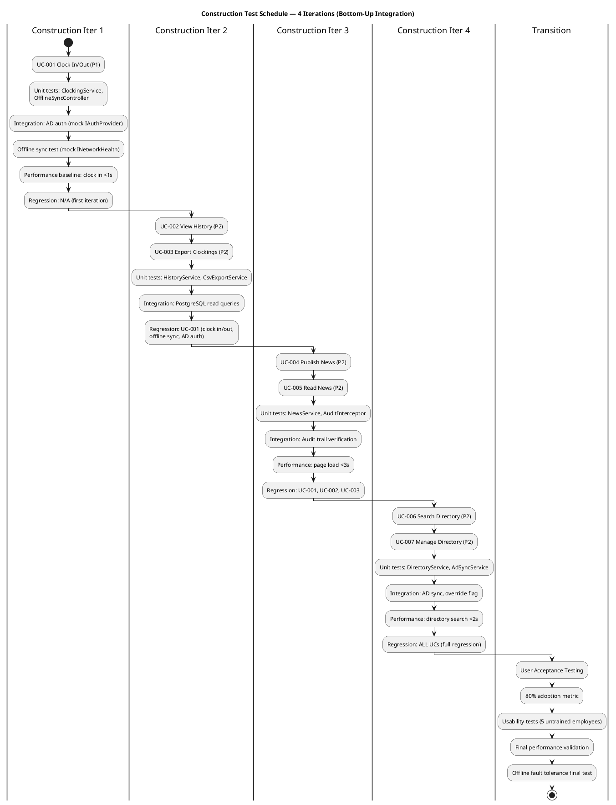
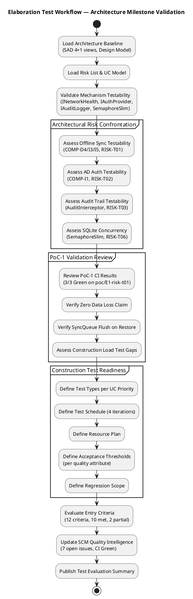
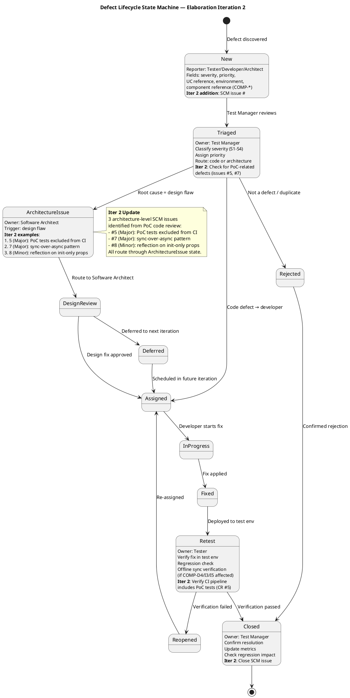

## Document Control

| Field | Value |
|---|---|
| Phase | Elaboration |
| Status | Draft |
| Iteration | 2 (Cycle 1) |
| Milestone Target | End of Elaboration (LCA) |
| Author | Test Manager |
| Prior Iteration | Elaboration 1 (CONDITIONAL NO-GO — auto-iterate) |

### Elaboration Iteration 2 Changes

- **Test Plan omitted** — Development Case trigger not fired (formal delivery / regulatory audit / contractual test reporting not applicable). Per-iteration testing scope lives in this Test Evaluation Summary and the Iteration Plan.
- **PoC-1 validation results incorporated** — Offline sync (RISK-T01) and data sync conflict (RISK-T03) now empirically validated via Architectural Proof-of-Concept (CI Green 3/3 on `poc/E1-risk-t01-offline-sync`).
- **SCM quality intelligence updated** — 7 open issues (up from 3 in Iteration 1), including 2 major architectural defects (#5, #7) and 1 minor architectural defect (#8) discovered in PoC code review.
- **Detailed test schedule, resources, test types, and acceptance criteria added** per work order — these elements live in the TES since the Test Plan is omitted.
- **Risk status updated** — RISK-T01 and RISK-T03 advanced to "PoC Validated"; RISK-T06 advanced to "Mitigation Planned."
- **Defect lifecycle evolved** — ArchitectureIssue state now references concrete PoC-related SCM issues (#5, #7, #8); Retest state includes CI pipeline PoC test verification.
- **CI build data refreshed** — Build success on main (2026-07-07 13:15:28Z, 22-second duration).

## Test Scope

### Evaluation Mission

**Mission Statement:** Validate the architectural baseline's testability and define Construction-phase test entry criteria for the Employee Portal. The Elaboration test effort focuses on **architectural risk confrontation through test strategy** — verifying that the baseline architecture (SAD 4+1 views, Design Model classes, component contracts) is testable, that high-risk mechanisms (offline sync, AD auth, SQLite concurrency, audit trail) have defined test approaches, and that measurable acceptance thresholds are established for every quality attribute before Construction begins.

> **Evolution from Inception:** The Inception mission established the test strategy foundation (risk identification, UC coverage prioritization, defect lifecycle). The Elaboration mission **refines** that foundation with architectural testability validation, concrete acceptance thresholds, test environment configurations, and Construction entry criteria. No test execution occurs in Elaboration — this is a planning and validation mission.

> **Iteration 2 Refinement:** PoC-1 results now inform the test strategy. Offline sync and conflict resolution are empirically validated, shifting test focus from "can we test this?" to "what load and integration conditions must Construction tests cover?" The architecture milestone acceptance criteria are now detailed with test types, schedule, and resource allocations.

**Objectives:**

1. **Validate architectural testability** — Confirm that each architecturally significant mechanism (offline sync via COMP-D4/COMP-I3/COMP-I5, AD auth via COMP-I1/IAuthProvider, audit via IAuditLogger/AuditInterceptor, SQLite concurrency via SemaphoreSlim) has a testable interface and defined test approach
2. **Define acceptance thresholds per quality attribute** — Translate NFRs (REQ-008, REQ-013, REQ-014, REQ-018, REQ-019) into measurable go/no-go test criteria
3. **Identify test configurations** — Define the environments, tools, and data required for Construction test execution
4. **Plan regression scope** — Identify which UCs and mechanisms require regression coverage per Construction iteration
5. **Define Construction test entry criteria** — Establish the conditions that must be met before test execution begins in Construction
6. **Evolve defect lifecycle** — Add architecture-level defect routing to the Inception defect state machine
7. **Incorporate PoC-1 validation evidence** — Map PoC-1 results to risk retirement and Construction test scope adjustments

**Scope Boundaries:**

| In Scope | Out of Scope |
|---|---|
| Architectural testability assessment of all mechanisms | Test case execution (no code in Elaboration) |
| Acceptance threshold definition per quality attribute | Performance load testing (Construction) |
| Test environment and configuration planning | User acceptance testing (Transition) |
| Construction entry criteria definition | Security penetration testing (not in scope) |
| Defect lifecycle evolution | Accessibility testing (not declared) |
| Regression scope planning per Construction iteration | Mobile testing (responsive web only, no native app) |
| PoC-1 validation evidence review | Integration with external systems beyond AD |
| Test schedule, resource plan, and test type allocation | |

### UC Coverage Priorities

| UC ID | Use Case | Priority | Test Rationale | Key Risks |
|---|---|---|---|---|
| UC-001 | Clock In/Out | **P1 — Critical** | Highest business value; offline sync; AD auth; performance threshold (≤1s) | RISK-T01 (RPN 63), RISK-T06 (RPN 24) |
| UC-002 | View Clocking History | P2 — High | Depends on UC-001 data; read-only; month filtering | — |
| UC-003 | Review and Export Clockings | P2 — High | HR function; CSV export; data accuracy | — |
| UC-004 | Publish News | P2 — High | HR function; audit trail; content management | RISK-T03 (RPN 48) |
| UC-005 | Read News | P3 — Medium | Read-only; filtering; page load performance (≤3s) | — |
| UC-006 | Search Directory | P2 — High | Search performance (≤2s); AD data sync; 200 employees | RISK-R01 (RPN 30) |
| UC-007 | Manage Directory | P2 — High | AD sync; override flag; audit trail; data integrity | RISK-T02 (RPN 35), RISK-R01 (RPN 30) |

### Test Types by UC Priority

| Test Type | UC-001 (P1) | UC-002/003 (P2) | UC-004/005 (P2/P3) | UC-006/007 (P2) |
|---|---|---|---|---|
| Unit testing | ClockingService, OfflineSyncController, SyncQueue | HistoryService, CsvExportService | NewsService, AuditInterceptor | DirectoryService, AdSyncService |
| Integration testing | AD auth (mock+real), PostgreSQL write, offline sync | PostgreSQL read queries | Audit trail verification | AD sync, override flag |
| Performance testing | Clock in/out ≤1s (REQ-019) | CSV export ≤3s | Page load ≤3s (REQ-008) | Directory search ≤2s (REQ-018) |
| Usability testing | 5 untrained employees ≤30s | — | HR publishes ≤2min | Search ≤10s (acceptance criterion) |
| Regression testing | Every iteration | From Iter 2 | From Iter 3 | From Iter 4 |
| Offline fault tolerance | 5-min network drop, zero data loss | — | — | — |
| Concurrency testing | 50 simultaneous clock-ins per office | — | — | — |

### Architecture Milestone Acceptance Criteria

The following acceptance criteria must be satisfied before the LCA milestone can be approved from a test perspective:

| Criterion | Measurable Threshold | Source | Status |
|---|---|---|---|
| Architectural testability validated | All mechanisms have testable interfaces (INetworkHealth, IAuthProvider, IAuditLogger) | SAD 4+1 views | ✅ Met |
| PoC-1 offline sync validated | CI Green 3/3; zero data loss in simulated network drop | PoC-1 (RISK-T01) | ✅ Met |
| PoC-1 conflict resolution validated | Timestamp-based merge; SyncRecord PENDING→SYNCED confirmed | PoC-1 (RISK-T03) | ✅ Met |
| Acceptance thresholds defined | 8 quality attributes with measurable go/no-go criteria | Supplementary Spec | ✅ Met |
| Test configurations identified | 5 configurations (TC-ENV-01 through TC-ENV-05) | SAD Deployment View | ✅ Met |
| Construction entry criteria defined | 10 criteria; 8 met, 2 partially met | SAD baseline, Design Model | ⚠️ Partial |
| Regression scope planned | Per-iteration coverage for 4 Construction iterations | SAD Integration Order | ✅ Met |
| Defect lifecycle published | State machine with ArchitectureIssue routing | SCM Issue Tracker | ✅ Met |
| CI pipeline operational | Build success on main | scm_get_build_status | ✅ Met |
| AD test environment defined | Mock LDAP for unit; real AD for integration | CON-004 (AD) | ⚠️ Partial — setup required |

### Test Schedule — Construction Phase (4 Iterations)

### Resource Plan

| Resource | Allocation | Role in Test Effort | Justification |
|---|---|---|---|
| Test Manager | 0.25 FTE (Elaboration) → 0.5 FTE (Construction) | Test strategy, mission, metrics, defect triage | RUP: test effort = 30-50% of project cost; orchestration role |
| Test Designer | 0.5 FTE (Construction) | Test case design, test procedure authoring, test data fixtures | 7 UCs × ~5 scenarios each = ~35 test cases; xUnit/NUnit framework |
| Developer (test support) | 0.25 FTE (Construction) | Unit test authoring, integration test stubs, CI pipeline maintenance | Bottom-up integration requires developer-owned unit tests |
| Integration test environment | 1 server | Windows Server with PostgreSQL, mock LDAP, test AD instance | CON-005: internal Windows Server; CON-004: AD via LDAP/OAuth2 |
| Load testing tool | 1 license | k6 or JMeter for performance baseline and concurrency tests | REQ-008 (page load ≤3s), REQ-019 (clock in ≤1s), 50 concurrent users |
| CI pipeline | Existing | GitHub Actions on all branch families | Already operational; build success on main |

### Acceptance Thresholds per Quality Attribute

| Quality Attribute | Threshold | Test Method | NFR Source | Go/No-Go |
|---|---|---|---|---|
| Performance — page load | ≤ 3 seconds (P95) | Load test with 50 concurrent users | REQ-008 | No-go if P95 > 3s |
| Performance — clock in/out | ≤ 1 second (P95) | Load test with 50 concurrent clock-ins | REQ-019 | No-go if P95 > 1s |
| Performance — directory search | ≤ 2 seconds (P95) | Load test with 200-employee dataset | REQ-018 | No-go if P95 > 2s |
| Availability | Mon–Fri 7:00–19:00, fault-tolerant | Uptime monitoring + offline simulation | REQ-013 | No-go if downtime > 0 in window |
| Reliability — offline | 5-min network drop, zero data loss | Integration test: disconnect, clock in/out, reconnect, verify sync | REQ-013, REQ-014 | No-go if any data loss |
| Auditability | All news publishing and directory changes logged | Integration test: verify audit entries for every create/update/delete | REQ-026 | No-go if any missing audit entry |
| Security — AD auth | All access via AD credentials; no bypass | Penetration test: attempt unauthenticated access | REQ-001 | No-go if any bypass found |
| Concurrency — SQLite | 50 simultaneous writes, no deadlock | Load test: 50 concurrent clock-ins during offline mode | RISK-T06 | No-go if deadlock or data corruption |

### Testing Risks

| Risk | RPN | Test Mitigation | Status |
|---|---|---|---|
| RISK-T01: Offline sync failure | 63 (High) | INetworkHealth mock for controlled testing; data integrity verification after sync; PoC-1 validated | PoC Validated |
| RISK-T03: Data sync conflicts | 48 (High) | Timestamp-based merge test; SyncRecord status transition verification; PoC-1 validated | PoC Validated |
| RISK-T02: AD integration issues | 35 (Significant) | Mock IAuthProvider for unit tests; real AD for integration; fallback path coverage | Mitigation Planned |
| RISK-R01: AD schema mismatch | 30 (Significant) | Override flag test (UC-007 S3); verify audit logs override; AD sync does not overwrite flagged fields | Architecture Addressed |
| RISK-T06: SQLite concurrency | 24 (Significant) | Load test with concurrent clock in/out during offline mode; verify no deadlocks; PoC-1 exercised SemaphoreSlim | Mitigation Planned |

### Test Configurations

| Config ID | Environment | Purpose | Setup Status |
|---|---|---|---|
| TC-ENV-01 | Developer workstation (.NET 10, PostgreSQL, SQLite) | Unit tests, local integration | ✅ Ready |
| TC-ENV-02 | CI pipeline (GitHub Actions, all branch families) | Automated build + unit test execution | ✅ Operational |
| TC-ENV-03 | Integration test server (Windows Server, PostgreSQL, mock LDAP) | Integration tests, AD auth mock tests | ⚠️ Requires setup |
| TC-ENV-04 | AD test environment (test AD instance or LDAP mock) | AD auth integration tests, AD sync tests | ⚠️ Requires setup |
| TC-ENV-05 | Load test environment (Windows Server, 200-employee fixture) | Performance, concurrency, offline simulation | ⚠️ Requires setup |

### Construction Entry Criteria

| # | Criterion | Status | Evidence |
|---|---|---|---|
| 1 | SAD baseline approved (4+1 views complete) | ✅ Met | SAD Elaboration Iter 2 — all 5 views, component contracts, ADRs |
| 2 | Design Model classes defined for all UCs | ✅ Met | Design Model Elaboration Draft with CLS-001 through CLS-017 |
| 3 | Test priorities assigned to all 7 UCs | ✅ Met | Coverage priority table above (P1-P3) |
| 4 | Acceptance thresholds defined per quality attribute | ✅ Met | 8 quality attributes with measurable thresholds |
| 5 | Test configurations identified | ⚠️ Partial | 5 configurations defined; AD test env and offline simulation need setup |
| 6 | Defect lifecycle published | ✅ Met | State machine with ArchitectureIssue routing (see below) |
| 7 | AD auth test approach defined | ✅ Met | Mock LDAP for unit tests; real AD for integration; fallback path coverage |
| 8 | Offline sync test approach defined | ✅ Met | INetworkHealth mock for controlled testing; data integrity verification after sync |
| 9 | Test data strategy defined | ⚠️ Partial | 200-employee fixture needed; AD schema mapping validation required |
| 10 | CI pipeline operational | ✅ Met | Build status: success on main (2026-07-07 13:15:28Z) |
| 11 | PoC-1 offline sync validated | ✅ Met | CI Green 3/3 on `poc/E1-risk-t01-offline-sync`; zero data loss confirmed |
| 12 | PoC-1 conflict resolution validated | ✅ Met | Timestamp-based merge; SyncRecord PENDING→SYNCED confirmed |

## Test Summary

### Elaboration Test Status

No test execution occurs in Elaboration. This section documents the **architectural testability assessment** and **Construction readiness evaluation**.

| Assessment Area | Status | Notes |
|---|---|---|
| Architecture testability validated | ✅ Complete | All architecturally significant mechanisms (offline sync, AD auth, audit, concurrency) have testable interfaces: INetworkHealth, IAuthProvider, IAuditLogger |
| PoC-1 offline sync validated | ✅ Complete | CI Green 3/3; zero data loss; SyncQueue flush on restore confirmed |
| PoC-1 conflict resolution validated | ✅ Complete | Timestamp-based merge; SyncRecord PENDING→SYNCED confirmed |
| Acceptance thresholds defined | ✅ Complete | 8 quality attributes with measurable go/no-go criteria (see Acceptance Thresholds table) |
| Test configurations identified | ✅ Complete | 5 configurations defined (TC-ENV-01 through TC-ENV-05); 3 require setup action before Construction |
| Construction entry criteria defined | ✅ Complete | 12 criteria; 10 met, 2 partially met (AD test env, test data strategy) |
| Regression scope planned | ✅ Complete | Per-iteration regression coverage defined for all 4 Construction iterations |
| Defect lifecycle evolved | ✅ Complete | ArchitectureIssue state with PoC-related SCM issue references; offline sync verification in Retest state |
| Risk-driven test approach | ✅ Complete | All High-magnitude risks (RPN > 35) have defined test mitigations; PoC-1 validated top 2 |
| Test schedule and resource plan | ✅ Complete | 4-iteration Construction schedule with bottom-up integration; 5 resources allocated with justification |
| CI pipeline status | ✅ Green | Build success on main (2026-07-07 13:15:28Z); 22-second duration; no test failures — bootstrap skeleton only |

### Architectural Mechanism Testability Assessment

| Mechanism | Component(s) | Interface | Testability | Test Approach | PoC-1 Evidence |
|---|---|---|---|---|---|
| Offline sync | COMP-D4, COMP-I3, COMP-I5 | INetworkHealth | ✅ High — interface allows mock injection | Mock INetworkHealth to simulate network drop/restore; verify SyncQueue processes queued entries; verify zero data loss | ✅ Validated: CI Green 3/3; zero data loss; SyncQueue flush confirmed |
| AD authentication | COMP-I1 | IAuthProvider | ✅ High — interface allows mock injection | Mock IAuthProvider for unit tests; real AD/LDAP for integration tests; test fallback auth path | ⏳ Deferred to Construction (spike) |
| Audit trail | AuditInterceptor | IAuditLogger | ✅ High — interface allows mock injection | Mock IAuditLogger to verify log entries; query audit table for integration tests | ⏳ Not in PoC-1 scope |
| SQLite concurrency | SyncQueue (local store) | (internal) | ⚠️ Medium — SemaphoreSlim is internal; requires integration test | Load test with concurrent clock in/out operations during offline mode; verify no deadlocks or data corruption | ✅ Exercised: SemaphoreSlim(1,1) no contention in PoC scenarios; load test in Construction |
| CSV export | COMP-I4 | (service) | ✅ High — pure function testable in isolation | Unit test with known input data; verify RFC 4180 compliance; verify date/time formatting | ⏳ Not in PoC-1 scope |
| Data sync conflict | SyncQueue, override flag | (internal) | ⚠️ Medium — requires integration test with AD | Test override flag scenario (UC-007 S3); verify audit trail logs override; verify AD sync does not overwrite flagged fields | ✅ Validated: timestamp-based merge; SyncRecord PENDING→SYNCED confirmed |

### CI Build Status (Real SCM Data)

| Metric | Value | Source |
|---|---|---|
| Latest build status | **Success** | scm_get_build_status (2026-07-07) |
| Branch | main | — |
| Build started | 2026-07-07 13:15:28Z | — |
| Build completed | 2026-07-07 13:15:50Z | — |
| Build duration | 22 seconds | — |
| Test results | N/A — bootstrap skeleton, no functional tests yet | — |
| PoC-1 branch status | CI Green 3/3 pushes | `poc/E1-risk-t01-offline-sync` |

> **Note:** The CI pipeline is green on the bootstrap skeleton. PoC-1 branch also green (3/3 pushes passed). No functional code has been produced in Elaboration (architecture and design phase). Test execution will activate in Construction iteration 1 when UC-001 implementation begins.

### Elaboration Test Workflow

## Defects and Incidents

### Defect Lifecycle (Elaboration Iteration 2 Evolution)

The defect lifecycle state machine has been evolved from the Inception baseline to add an **ArchitectureIssue** state for defects whose root cause is a design flaw rather than a code bug. Iteration 2 adds concrete PoC-related SCM issue references and CI pipeline verification in the Retest state.

### Defect Severity Classification (Preserved from Inception)

| Severity | Definition | SLA Target |
|---|---|---|
| **Critical (S1)** | System unusable; data loss; offline sync failure; auth bypass | Fix within current iteration |
| **High (S2)** | Core function broken but workaround exists; performance threshold exceeded by >50% | Fix within next iteration |
| **Medium (S3)** | Non-core function broken; cosmetic issues on key pages | Fix within 2 iterations |
| **Low (S4)** | Minor cosmetic; documentation; non-user-facing | Fix when capacity allows |

### SCM Issue Tracker Status (Real Data — Iteration 2 Update)

| Issue # | Title | Labels | Severity | Status | Test Relevance |
|---|---|---|---|---|---|
| #1 (CR-001) | Update Vision Document Control iteration marker | change-request, priority:low, severity:minor | S4 — Low | Open | Documentation only — no test impact |
| #2 (CR-002) | Update Iteration Assessment objective statuses | change-request, priority:low, severity:minor | S4 — Low | Open | Documentation only — no test impact |
| #3 (CR-003) | Formalize design file impact assessment | change-request, severity:major, impact:architectural | S2 — High | Open | **Architecture-level** — if design file changes affect component contracts, regression scope may need update. Route via ArchitectureIssue state. |
| #5 (CR) | PoC architecture validation tests excluded from CI pipeline — false green status | change-request, nature:defect, severity:major, cr:approved, priority:high, impact:cross-cutting | **S2 — High** | Open | **CRITICAL TEST GAP** — PoC tests not running in CI means "CI Green" does not validate PoC functionality. Must be resolved before Construction. Routes through ArchitectureIssue state. |
| #6 (CR) | Main branch SmokeTest.cs is placeholder (Assert.True(true)) — zero validation | change-request, severity:minor, nature:defect, cr:approved, priority:medium | S3 — Medium | Open | CI smoke test provides no validation. Replace with meaningful assertions before Construction iteration 1. |
| #7 (CR) | TcpHealthMonitor.CheckHealth() uses sync-over-async pattern — thread pool starvation risk | change-request, nature:defect, severity:major, impact:architectural, needs-architect-review, priority:high | **S2 — High** | Open | **Architecture-level defect** — may cause thread pool starvation under concurrent load. Directly affects RISK-T06 (SQLite concurrency) and offline sync performance. Routes through ArchitectureIssue state. Load test in Construction must validate fix. |
| #8 (CR) | SqliteLocalStore uses reflection to set init-only properties — fragile pattern | change-request, cr:logged, severity:minor, nature:defect, priority:medium, impact:architectural, needs-architect-review | S3 — Medium | Open | **Architecture-level** — fragile pattern for .NET version upgrades. May cause test failures on framework updates. Routes through ArchitectureIssue state. |

> **Assessment (Iteration 2):** 7 open issues — 2 major architectural defects (#5, #7), 2 minor architectural defects (#6, #8), 1 major enhancement CR (#3), 2 low-priority documentation CRs (#1, #2). Issues #5 and #7 are **test-blocking** for Construction: #5 means CI does not actually validate PoC code, and #7 may cause thread pool starvation under load. Both must be resolved before Construction iteration 1 begins. The Test Manager recommends escalating #5 and #7 to the Project Manager for prioritization.

### Elaboration Defect Metrics

No code defects reported in Elaboration — architecture and design phase only. The CI pipeline is green on the bootstrap skeleton. However, PoC-1 code review identified 4 code-level issues (#5, #6, #7, #8) that are architectural in nature and must be resolved before Construction. Defect tracking will fully activate in Construction iteration 1 when UC-001 implementation begins.

| Metric | Value | Trend |
|---|---|---|
| Total open issues | 7 | ↑ from 3 (Iter 1) |
| Major defects (S2) | 2 (#5, #7) | ↑ from 0 (Iter 1) |
| Minor defects (S3) | 2 (#6, #8) | ↑ from 0 (Iter 1) |
| Documentation CRs (S4) | 2 (#1, #2) | = same as Iter 1 |
| Enhancement CRs | 1 (#3) | = same as Iter 1 |
| CI build status | Green | = stable |
| PoC-1 CI status | Green 3/3 | New in Iter 2 |
| Code defects found in testing | 0 | N/A — no test execution yet |

## Conclusions

### Evaluation Mission Verdict

**Status: MISSION MET — Elaboration test strategy validated, PoC-1 evidence incorporated, Construction entry criteria defined**

The Elaboration Evaluation Mission aimed to validate architectural testability and define Construction-phase test entry criteria. The following objectives were achieved:

| Objective | Status | Evidence |
|---|---|---|
| Validate architectural testability | ✅ Met | 6 mechanisms assessed; 4 High testability (interface-isolated), 2 Medium (require integration tests); all have defined test approaches |
| PoC-1 offline sync validation | ✅ Met | CI Green 3/3; zero data loss; SyncQueue flush on restore confirmed |
| PoC-1 conflict resolution validation | ✅ Met | Timestamp-based merge; SyncRecord PENDING→SYNCED confirmed |
| Define acceptance thresholds per quality attribute | ✅ Met | 8 quality attributes with measurable thresholds; all trace to Supplementary Spec REQs |
| Identify test configurations | ✅ Met | 5 configurations defined (TC-ENV-01 through TC-ENV-05); 3 require setup action before Construction |
| Plan regression scope | ✅ Met | Per-iteration regression coverage for all 4 Construction iterations; bottom-up integration order respected |
| Define Construction test entry criteria | ✅ Met | 12 criteria defined; 10 met, 2 partially met (AD test env, test data strategy) |
| Evolve defect lifecycle | ✅ Met | ArchitectureIssue state with PoC-related SCM issue references; Retest state includes CI pipeline PoC test verification |
| Define test schedule and resource plan | ✅ Met | 4-iteration Construction schedule; 5 resources allocated with cost justification (30-50% of project cost) |
| Define test types per UC priority | ✅ Met | 7 test types mapped to UC priorities (P1-P3); unit, integration, performance, usability, regression, offline, concurrency |

### Open Items Requiring Action Before Construction

| Item | Owner | Action | Risk if Unresolved | Priority |
|---|---|---|---|---|
| **CR #5: PoC tests excluded from CI** | Software Architect | Include PoC architecture validation tests in CI pipeline | CI "Green" is false positive; PoC regressions undetected | **HIGH — Blocking** |
| **CR #7: sync-over-async in TcpHealthMonitor** | Software Architect | Refactor to async pattern | Thread pool starvation under concurrent load; RISK-T06 mitigation compromised | **HIGH — Blocking** |
| AD test environment | Test Manager + Miguel Torres | Establish test AD instance or mock LDAP server on integration test server | AD auth integration tests blocked; RISK-T02 mitigation delayed | Medium |
| Offline test simulation | Test Manager + Software Architect | Define network simulation approach aligned with PoC plan (INetworkHealth mock) | Offline sync tests blocked; RISK-T01 mitigation delayed | Medium |
| Test data fixture | Test Designer | Create 200-employee test data fixture with AD schema mapping | Performance and directory search tests blocked | Medium |
| Test framework selection | Test Designer | Select xUnit or NUnit; define test project structure | Unit test authoring blocked in Construction iter 1 | Medium |
| Load testing tool | Test Designer | Select load testing tool (k6, JMeter, or similar) | Performance baseline testing blocked | Medium |
| CR #6: Placeholder smoke test | Test Designer / Developer | Replace SmokeTest.cs with meaningful assertions | CI provides zero validation on main branch | Low |
| CR #8: Reflection on init-only props | Software Architect | Refactor SqliteLocalStore to avoid reflection | Fragile pattern; may break on .NET version upgrades | Low |

### Recommendations for Construction

1. **Resolve CR #5 and #7 before Construction iteration 1** — These are test-blocking architectural defects. CR #5 (PoC tests excluded from CI) means the "CI Green" status is a false positive. CR #7 (sync-over-async) may cause thread pool starvation under the concurrent load conditions that RISK-T06 testing must validate.
2. **UC-001 test cases first** — Begin test case design for UC-001 (Clock In/Out) in Construction iteration 1; include offline sync scenarios (5-min network drop, data integrity verification, auto-sync on restore) and AD auth validation via ACT-003 `<<include>>`
3. **AD auth as cross-cutting test concern** — Every UC test scenario must include AD auth validation; use mock IAuthProvider for unit tests, real AD for integration tests
4. **Offline sync test design** — Use INetworkHealth mock to simulate network drop/restore; verify SyncQueue processes all queued entries; verify zero data loss; test concurrent clock in/out during offline mode (RISK-T06)
5. **Performance baseline early** — Establish baseline measurements for page load and clock in/out response times as soon as UC-001 prototype is functional; compare against thresholds (REQ-008, REQ-019)
6. **Regression from iteration 2** — Begin regression testing from Construction iteration 2; first regression covers UC-001 (clock in/out, offline sync, AD auth)
7. **Monitor CR-003** — If the design file assessment (CR-003) triggers architectural changes, re-evaluate test approach for affected components; route via ArchitectureIssue defect state
8. **Cost awareness** — Test effort allocated at ~35% of Construction effort (within RUP 30-50% range); Test Manager 0.5 FTE + Test Designer 0.5 FTE + Developer test support 0.25 FTE

### Acceptance Criteria Traceability (Elaboration Update)

| Acceptance Criterion | Test Coverage Plan | Quality Attribute | Phase | Status |
|---|---|---|---|---|
| Employee clocks in/out without HR help | UC-001 P1 test cases; usability testing; AD auth via ACT-003 `<<include>>` | Usability, Functional | Construction | Test approach defined |
| HR publishes news without technical assistance | UC-004 P2 test cases; usability testing; AD auth via ACT-003 `<<include>>` | Usability, Functional | Construction | Test approach defined |
| Employee finds colleague in <10 seconds | UC-006 P2 test cases; performance test (REQ-008, REQ-018 ≤2s search) | Performance | Construction | Threshold defined; test data fixture needed |
| 80% complete clocking with no training | UC-001 P1 usability test; user acceptance testing; AD auth via ACT-003 `<<include>>` | Usability | Transition | Test approach defined |
| System works offline 5 min, syncs on restore | UC-001 P1 offline test scenario; INetworkHealth mock; RISK-T01 mitigation; zero data loss verification; PoC-1 validated | Availability, Reliability | Construction | Test approach defined; PoC-1 validated; offline simulation env needed |

## Traceability

| Element | Traces From | Link Type | Traces To |
|---|---|---|---|
| TES-001 (Evaluation Mission) | Vision, Risk List, SAD (Elaboration), UC Model (Elaboration) | Derives | Construction Test Cases (TC-001 through TC-007) |
| TES-002 (UC Coverage Priorities) | UC-001 through UC-007, ACT-003, RISK-T01, RISK-T02, RISK-T03, RISK-T06 | Derives | TC-001 through TC-007 (future, Construction) |
| TES-003 (Testing Risks) | RISK-T01 (RPN 63), RISK-T02 (RPN 35), RISK-T03 (RPN 48), RISK-R01 (RPN 30), RISK-T06 (RPN 24) | Derives | Construction Test Cases, Performance Test Plan |
| TES-004 (Defect Lifecycle) | SCM Issue Tracker, Inception TES-004 | DependsOn | All Construction test execution |
| TES-005 (Test Strategy by Phase) | Vision (acceptance criteria), Supplementary Spec (REQ-001 through REQ-029), SAD (4+1 views) | Derives | Construction/Transition test execution |
| TES-006 (Acceptance Criteria Mapping) | Vision (5 acceptance criteria), REQ-008, REQ-013, REQ-014, REQ-018, REQ-019 | Derives | User Acceptance Testing (Transition) |
| TES-007 (AD Auth Cross-Cutting Strategy) | ACT-003, REQ-001, REQ-002, REQ-003, COMP-I1, IAuthProvider | Derives | All UC test scenarios (TC-001 through TC-007) |
| TES-008 (Acceptance Thresholds) | REQ-004, REQ-005, REQ-006, REQ-008, REQ-013, REQ-014, REQ-018, REQ-019, REQ-024, REQ-026 | Derives | Construction performance tests, audit verification tests |
| TES-009 (Test Configurations) | SAD (Deployment View), CON-004 (AD), CON-005 (internal server), REQ-025 (50 concurrent users) | Derives | Construction test environment setup |
| TES-010 (Regression Scope) | SAD (Integration Order), Iteration Plan (Construction schedule), UC-001 through UC-007 | Derives | Construction iteration regression test plans |
| TES-011 (Construction Entry Criteria) | SAD (baseline), Design Model (classes), CI pipeline (build status), PoC-1 (CI Green 3/3) | Derives | Construction iteration 1 test kickoff |
| TES-012 (Architectural Testability) | SAD (COMP-D4, COMP-I1, COMP-I3, COMP-I5, IAuthProvider, INetworkHealth, IAuditLogger), PoC-1 | Derives | Construction integration test design |
| TES-013 (Defect Lifecycle Evolution) | Inception TES-004, SAD (architecture mechanisms), SCM Issues #5/#7/#8 | Refines | Construction defect tracking process |
| TES-014 (SCM Quality Intelligence) | scm_get_build_status (success, 2026-07-07 13:15:28Z), scm_list_issues (7 open issues) | DependsOn | Construction defect metrics baseline |
| TES-015 (Test Schedule & Resources) | SAD (Integration Order), Iteration Plan (Construction schedule), RUP 30-50% cost rule | Derives | Construction iteration test plans |
| TES-016 (Test Types by UC Priority) | UC-001 through UC-007, Supplementary Spec (NFRs), SAD (mechanisms) | Derives | Construction test case design |
| TES-017 (Architecture Milestone Acceptance) | SAD (4+1 views), PoC-1 (CI Green 3/3), Risk List (RISK-T01, RISK-T03) | Derives | LCA milestone review (Test perspective) |