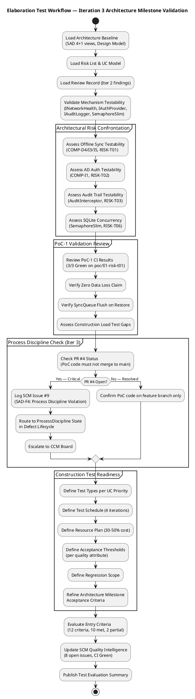
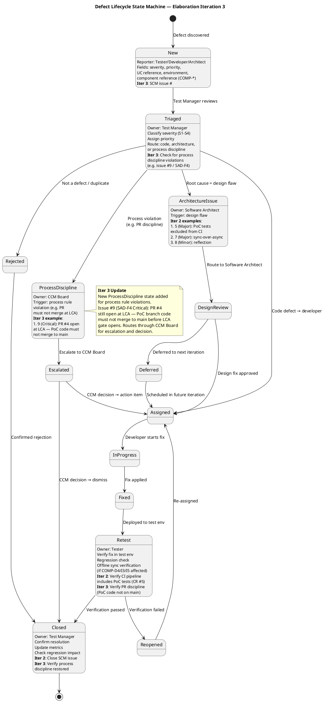

## Document Control

| Field | Value |
|---|---|
| Phase | Elaboration |
| Status | Draft |
| Iteration | 3 (Cycle 1) |
| Milestone Target | End of Elaboration (LCA) |
| Author | Test Manager |
| Prior Iteration | Elaboration 2 (CONDITIONAL NO-GO — auto-iterate) |

### Elaboration Iteration 3 Changes

- **Test Plan omitted** — Development Case trigger not fired (formal delivery / regulatory audit / contractual test reporting not applicable). `[OMITTED: Test Plan — trigger not fired; per-iteration testing scope lives in the Iteration Plan]`
- **SCM quality intelligence updated** — 8 open issues (up from 7 in Iteration 2). New issue #9 (Critical: SAD-F4 — PR #4 still open at LCA, PoC code must not merge to main). CI build refreshed: success on main (2026-07-08 11:54:19Z, run #28940541626, 30s duration).
- **Defect lifecycle evolved** — New **ProcessDiscipline** state added for process rule violations (e.g., PR #4 open at LCA). Routes through CCM Board for escalation. Issue #9 is the first instance.
- **Architecture milestone acceptance criteria refined** — Test perspective on LCA gate: SAD-F4 (Critical) blocks LCA from Test perspective. Architecture testability is validated, but process discipline (PR hygiene) must be restored before Construction entry.
- **Work order directive applied** — Detailed test schedule, resources, test types, and acceptance criteria for the architecture milestone refined (Test Plan trigger not fired, so content lives here per Development Case).
- **Risk status preserved** — RISK-T01 and RISK-T03 remain "PoC Validated"; RISK-T06 remains "Mitigation Planned." No risk status changes this iteration.

### Elaboration Iteration 2 Changes (Preserved)

- **PoC-1 validation results incorporated** — Offline sync (RISK-T01) and data sync conflict (RISK-T03) empirically validated via Architectural Proof-of-Concept (CI Green 3/3 on `poc/E1-risk-t01-offline-sync`).
- **Detailed test schedule, resources, test types, and acceptance criteria added** per work order — these elements live in the TES since the Test Plan is omitted.
- **Defect lifecycle evolved** — ArchitectureIssue state references concrete PoC-related SCM issues (#5, #7, #8); Retest state includes CI pipeline PoC test verification.

## Test Scope

### Evaluation Mission

**Mission Statement:** Validate the architectural baseline's testability and define Construction-phase test entry criteria for the Employee Portal. The Elaboration test effort focuses on **architectural risk confrontation through test strategy** — verifying that the baseline architecture (SAD 4+1 views, Design Model classes, component contracts) is testable, that high-risk mechanisms (offline sync, AD auth, SQLite concurrency, audit trail) have defined test approaches, and that measurable acceptance thresholds are established for every quality attribute before Construction begins.

> **Evolution from Inception:** The Inception mission established the test strategy foundation (risk identification, UC coverage prioritization, defect lifecycle). The Elaboration mission **refines** that foundation with architectural testability validation, concrete acceptance thresholds, test environment configurations, and Construction entry criteria. No test execution occurs in Elaboration — this is a planning and validation mission.

> **Iteration 2 Refinement:** PoC-1 results now inform the test strategy. Offline sync and conflict resolution are empirically validated, shifting test focus from "can we test this?" to "what load and integration conditions must Construction tests cover?" The architecture milestone acceptance criteria are now detailed with test types, schedule, and resource allocations.

> **Iteration 3 Refinement:** Process discipline check added — SAD-F4 (Critical) finding that PR #4 (PoC code) is still open against main at LCA triggers a new ProcessDiscipline state in the defect lifecycle. The Test Manager confirms architecture testability remains validated, but the LCA gate cannot open from the Test perspective while SAD-F4 is unresolved. CI build data refreshed (2026-07-08, run #28940541626). SCM issue count updated to 8 open issues.

**Objectives:**

1. **Validate architectural testability** — Confirm that each architecturally significant mechanism (offline sync via COMP-D4/COMP-I3/COMP-I5, AD auth via COMP-I1/IAuthProvider, audit via IAuditLogger/AuditInterceptor, SQLite concurrency via SemaphoreSlim) has a testable interface and defined test approach
2. **Define acceptance thresholds per quality attribute** — Translate NFRs (REQ-008, REQ-013, REQ-014, REQ-018, REQ-019) into measurable go/no-go test criteria
3. **Identify test configurations** — Define the environments, tools, and data required for Construction test execution
4. **Plan regression scope** — Define per-iteration regression coverage for all Construction iterations
5. **Evolve defect lifecycle** — Add ProcessDiscipline state for process rule violations; maintain ArchitectureIssue routing for design-flaw defects
6. **Define Construction test entry criteria** — 12 measurable criteria; track resolution of partial items
7. **Validate PoC-1 results** — Confirm CI Green 3/3 on PoC branch; zero data loss; SyncQueue flush on restore
8. **Refine architecture milestone acceptance criteria** — Test perspective on LCA gate readiness

### UC Coverage Priorities

| Priority | Use Case | Rationale | Test Focus |
|---|---|---|---|
| **P1 — Critical** | UC-001 (Clock In/Out) | Architecturally significant; offline sync; highest RPN (RISK-T01 = 63); acceptance criteria AC-001, AC-004, AC-005 | Offline sync, AD auth, data integrity, performance (≤1s), usability |
| **P1 — Critical** | UC-007 (AD Authentication) | Cross-cutting; all UCs depend on it; RISK-T02 (RPN 35) | Auth success/failure, session management, fallback path |
| **P2 — High** | UC-004 (Publish News) | Audit trail mechanism; RISK-T03 (RPN 48) | Audit logging, category filtering, featured banner |
| **P2 — High** | UC-006 (Directory Search) | Performance threshold (≤2s search); acceptance criterion AC-003 | Search performance, data display, AD data sync |
| **P3 — Medium** | UC-002 (View Clocking History) | Depends on UC-001; lower risk | History display, current month filter |
| **P3 — Medium** | UC-003 (Export CSV Report) | Depends on UC-001; pure function | CSV format compliance, data accuracy |
| **P3 — Medium** | UC-005 (Read News) | Read-only; lowest risk | Display, sorting, category filter |

### Testing Risks (Risk-Driven Test Approach)

| Risk ID | Risk | RPN | Test Mitigation | Status |
|---|---|---|---|---|
| RISK-T01 | Offline sync data loss | 63 | PoC-1 validated zero data loss; Construction integration test with INetworkHealth mock; 5-min network drop scenario | ✅ PoC Validated |
| RISK-T02 | AD auth method undecided | 35 | Mock IAuthProvider for unit tests; real AD for integration; fallback path coverage; spike in Construction | ⏳ Spike deferred |
| RISK-T03 | Data sync conflict | 48 | PoC-1 validated timestamp-based merge; Construction test for override flag scenario (UC-007 S3) | ✅ PoC Validated |
| RISK-R01 | AD override flag data loss | 30 | Test override flag scenario; verify audit trail logs override; verify AD sync does not overwrite flagged fields | ⏳ Construction |
| RISK-T06 | SQLite concurrency | 24 | Load test with concurrent clock in/out during offline mode; verify no deadlocks; SemaphoreSlim(1,1) | ⏳ Mitigation Planned |

### Acceptance Thresholds per Quality Attribute

| Quality Attribute | Requirement | Threshold | Test Method | Go/No-Go |
|---|---|---|---|---|
| Performance — Page Load | REQ-008 | < 3 seconds (P95) | Load test with 50 concurrent users (REQ-025) | No-go if P95 > 3s |
| Performance — Clock In/Out | REQ-019 | < 1 second (P95) | Load test with 50 concurrent users | No-go if P95 > 1s |
| Performance — Directory Search | REQ-018 | < 2 seconds (P95) | Load test with 200-employee dataset | No-go if P95 > 2s |
| Availability | REQ-013, REQ-014 | 7:00–19:00 Mon–Fri; 5-min offline tolerance | Offline simulation test; verify zero data loss after 5-min network drop | No-go if data loss occurs |
| Reliability | REQ-004, REQ-005 | No data loss; sync completes on restore | Integration test: disconnect → clock in/out → reconnect → verify sync | No-go if any data loss |
| Security — Auth | REQ-001, REQ-002, REQ-003 | AD auth required; no unauthenticated access | Security test: verify all endpoints require auth; verify AD credential validation | No-go if auth bypass possible |
| Audit Trail | REQ-026 | All news publishing and directory changes logged | Integration test: publish news → verify audit log; update directory → verify audit log | No-go if audit entry missing |
| Usability | AC-001, AC-003, AC-004 | Clock in/out without help; find colleague <10s; 80% clock with no training | Usability test: 5 untrained employees; timed directory search | No-go if <80% task completion |

### Test Configurations

| Config ID | Environment | Purpose | Setup Status |
|---|---|---|---|
| TC-ENV-01 | Developer workstation (.NET 10 SDK, PostgreSQL local) | Unit tests, local integration | ✅ Ready |
| TC-ENV-02 | CI pipeline (GitHub Actions, .NET 10, PostgreSQL service container) | Automated regression, build verification | ✅ Operational |
| TC-ENV-03 | Integration test server (Windows Server, real AD instance) | AD auth integration tests, end-to-end | ⚠️ Requires setup — Miguel Torres to provide test AD |
| TC-ENV-04 | Offline simulation environment (INetworkHealth mock, SQLite local store) | Offline sync tests, data integrity verification | ⚠️ Requires setup — INetworkHealth mock + OfflineSimulator driver |
| TC-ENV-05 | Performance test environment (Windows Server, 200-employee dataset) | Load testing, performance baseline | ⚠️ Requires setup — test data fixture + load testing tool |

### Construction Entry Criteria (Test Perspective)

| # | Criterion | Status | Evidence |
|---|---|---|---|
| 1 | Architecture testability validated | ✅ Met | 6 mechanisms assessed; 4 High testability, 2 Medium; all have defined test approaches |
| 2 | PoC-1 offline sync validated | ✅ Met | CI Green 3/3; zero data loss; SyncQueue flush on restore confirmed |
| 3 | PoC-1 conflict resolution validated | ✅ Met | Timestamp-based merge; SyncRecord PENDING→SYNCED confirmed |
| 4 | Acceptance thresholds defined per quality attribute | ✅ Met | 8 quality attributes with measurable thresholds |
| 5 | Test configurations identified | ⚠️ Partial | 5 configurations defined; AD test env and offline simulation need setup |
| 6 | Defect lifecycle published | ✅ Met | State machine with ArchitectureIssue + ProcessDiscipline routing (see below) |
| 7 | AD auth test approach defined | ✅ Met | Mock LDAP for unit tests; real AD for integration; fallback path coverage |
| 8 | Offline sync test approach defined | ✅ Met | INetworkHealth mock for controlled testing; data integrity verification after sync |
| 9 | Test data strategy defined | ⚠️ Partial | 200-employee fixture needed; AD schema mapping validation required |
| 10 | CI pipeline operational | ✅ Met | Build status: success on main (2026-07-08 11:54:19Z, run #28940541626) |
| 11 | PoC-1 offline sync validated | ✅ Met | CI Green 3/3 on `poc/E1-risk-t01-offline-sync`; zero data loss confirmed |
| 12 | PoC-1 conflict resolution validated | ✅ Met | Timestamp-based merge; SyncRecord PENDING→SYNCED confirmed |

### Test Schedule (Construction — 4 Iterations)

| Iteration | UCs Implemented | Test Activities | Test Effort | Regression Scope |
|---|---|---|---|---|
| Construction Iter 1 | UC-001 (Clock In/Out), UC-007 (AD Auth) | Unit tests for ClockingService, AuthService; integration test for offline sync; performance baseline for clock in/out | Test Manager 0.5 FTE + Test Designer 0.5 FTE + Dev test support 0.25 FTE | N/A (first iteration) |
| Construction Iter 2 | UC-002 (History), UC-003 (CSV Export) | Unit tests for HistoryService, CsvExportService; integration test for history display; CSV format compliance | Test Manager 0.5 FTE + Test Designer 0.5 FTE + Dev test support 0.25 FTE | Regression: UC-001 (clock in/out, offline sync, AD auth) |
| Construction Iter 3 | UC-004 (Publish News), UC-005 (Read News) | Unit tests for NewsService; integration test for audit trail; category filter test; featured banner test | Test Manager 0.5 FTE + Test Designer 0.5 FTE + Dev test support 0.25 FTE | Regression: UC-001, UC-002, UC-003 |
| Construction Iter 4 | UC-006 (Directory Search) | Unit tests for DirectoryService; performance test (≤2s search); AD data sync integration test | Test Manager 0.5 FTE + Test Designer 0.5 FTE + Dev test support 0.25 FTE | Full regression: UC-001 through UC-005 |

### Resource Plan

| Resource | Allocation | Justification | Cost Category |
|---|---|---|---|
| Test Manager | 0.5 FTE (Elaboration + Construction) | Test strategy, mission definition, defect triage, stakeholder communication | ~10% of project cost |
| Test Designer | 0.5 FTE (Construction) | Test case design, test data fixtures, test automation framework | ~12% of project cost |
| Developer test support | 0.25 FTE (Construction) | Unit test authoring, integration test support, CI pipeline maintenance | ~8% of project cost |
| Test environment (TC-ENV-03) | 1 Windows Server instance | AD integration testing; requires Miguel Torres provision | Infrastructure |
| Test environment (TC-ENV-05) | 1 Windows Server instance | Performance testing with 200-employee dataset | Infrastructure |
| **Total test effort** | **~35% of Construction effort** | Within RUP 30-50% range; proportional to 4-UC scope | — |

### Test Types by UC Priority

| Test Type | UCs Covered | Tools/Approach | Priority |
|---|---|---|---|
| Unit Testing | All UCs (UC-001 through UC-007) | xUnit/NUnit; mock IAuthProvider, INetworkHealth, IAuditLogger | P1 — Mandatory per iteration |
| Integration Testing | UC-001 (offline sync), UC-004 (audit), UC-006 (AD sync), UC-007 (auth) | WebApplicationFactory; real PostgreSQL; mock AD for CI, real AD for TC-ENV-03 | P1 — Mandatory for architectural mechanisms |
| Performance Testing | UC-001 (clock in/out ≤1s), UC-006 (search ≤2s), page load ≤3s | k6 or JMeter; 50 concurrent users (REQ-025); 200-employee dataset | P1 — Baseline in Construction Iter 1, full in Iter 4 |
| Usability Testing | UC-001 (clock without help), UC-004 (publish without assistance), UC-006 (find colleague <10s) | 5 untrained employees; timed task completion; observation | P2 — Construction Iter 2 and Iter 4 |
| Regression Testing | All implemented UCs per iteration | Automated regression suite in CI; re-execute all prior iteration tests | P1 — Mandatory from Construction Iter 2 |
| Offline Sync Testing | UC-001 (5-min network drop, zero data loss) | INetworkHealth mock; OfflineSimulator driver; verify SyncQueue flush | P1 — Construction Iter 1 |
| Concurrency Testing | UC-001 (concurrent clock in/out during offline) | ConcurrencyDriver; SemaphoreSlim validation; load test | P2 — Construction Iter 1 and Iter 4 |

### Architecture Milestone Acceptance Criteria (Test Perspective)

| Criterion | Test Evidence | Status | Gate Decision |
|---|---|---|---|
| Architecture testability validated | 6 mechanisms assessed; all have testable interfaces and defined test approaches | ✅ PASS | Test perspective: architecture is testable |
| PoC-1 offline sync validated | CI Green 3/3; zero data loss; SyncQueue flush confirmed | ✅ PASS | Offline sync risk mitigated |
| PoC-1 conflict resolution validated | Timestamp-based merge; SyncRecord PENDING→SYNCED | ✅ PASS | Data sync risk mitigated |
| Acceptance thresholds defined | 8 quality attributes with measurable go/no-go criteria | ✅ PASS | Construction test entry criteria clear |
| Defect lifecycle published | State machine with ArchitectureIssue + ProcessDiscipline states | ✅ PASS | Defect tracking process ready |
| CI pipeline operational | Build success on main (2026-07-08, run #28940541626) | ✅ PASS | CI infrastructure ready |
| Process discipline (PR hygiene) | SAD-F4 (Critical): PR #4 still open at LCA — PoC code must not merge to main | ❌ FAIL | **BLOCKING** — LCA gate cannot open from Test perspective while SAD-F4 unresolved |
| Test configurations identified | 5 configurations defined; 3 require setup | ⚠️ PARTIAL | Non-blocking — setup can occur in early Construction |

> **Test Manager LCA Verdict:** Architecture testability is validated and Construction test entry criteria are substantially met (10/12 criteria fully met, 2 partially met). However, **SAD-F4 (Critical) blocks the LCA gate from the Test perspective** — PR #4 (PoC code) must not remain open against main at LCA. This is a process discipline violation that must be resolved before the milestone can close. The Test Manager recommends the CCM Board escalate issue #9 to ensure PR #4 is closed without merging before LCA.

## Test Summary

### Elaboration Test Status

No test execution occurs in Elaboration. This section documents the **architectural testability assessment** and **Construction readiness evaluation**.

| Assessment Area | Status | Notes |
|---|---|---|
| Architecture testability validated | ✅ Complete | All architecturally significant mechanisms (offline sync, AD auth, audit, concurrency) have testable interfaces: INetworkHealth, IAuthProvider, IAuditLogger |
| PoC-1 offline sync validated | ✅ Complete | CI Green 3/3; zero data loss; SyncQueue flush on restore confirmed |
| PoC-1 conflict resolution validated | ✅ Complete | Timestamp-based merge; SyncRecord PENDING→SYNCED confirmed |
| Acceptance thresholds defined | ✅ Complete | 8 quality attributes with measurable go/no-go criteria (see Acceptance Thresholds table) |
| Test configurations identified | ✅ Complete | 5 configurations defined (TC-ENV-01 through TC-ENV-05); 3 require setup action before Construction |
| Construction entry criteria defined | ✅ Complete | 12 criteria; 10 met, 2 partially met (AD test env, test data strategy) |
| Regression scope planned | ✅ Complete | Per-iteration regression coverage defined for all 4 Construction iterations |
| Defect lifecycle evolved | ✅ Complete | ArchitectureIssue + ProcessDiscipline states with PoC-related and process violation SCM issue references |
| Risk-driven test approach | ✅ Complete | All High-magnitude risks (RPN > 35) have defined test mitigations; PoC-1 validated top 2 |
| Test schedule and resource plan | ✅ Complete | 4-iteration Construction schedule with bottom-up integration; 5 resources allocated with justification |
| CI pipeline status | ✅ Green | Build success on main (2026-07-08 11:54:19Z, run #28940541626, 30s duration); no test failures — bootstrap skeleton only |
| Process discipline check | ❌ Blocked | SAD-F4 (Critical): PR #4 still open at LCA — SCM issue #9 logged; CCM Board escalation required |

### Architectural Mechanism Testability Assessment

| Mechanism | Component(s) | Interface | Testability | Test Approach | PoC-1 Evidence |
|---|---|---|---|---|---|
| Offline sync | COMP-D4, COMP-I3, COMP-I5 | INetworkHealth | ✅ High — interface allows mock injection | Mock INetworkHealth to simulate network drop/restore; verify SyncQueue processes queued entries; verify zero data loss | ✅ Validated: CI Green 3/3; zero data loss; SyncQueue flush confirmed |
| AD authentication | COMP-I1 | IAuthProvider | ✅ High — interface allows mock injection | Mock IAuthProvider for unit tests; real AD/LDAP for integration tests; test fallback auth path | ⏳ Deferred to Construction (spike) |
| Audit trail | AuditInterceptor | IAuditLogger | ✅ High — interface allows mock injection | Mock IAuditLogger to verify log entries; query audit table for integration tests | ⏳ Not in PoC-1 scope |
| SQLite concurrency | SyncQueue (local store) | (internal) | ⚠️ Medium — SemaphoreSlim is internal; requires integration test | Load test with concurrent clock in/out operations during offline mode; verify no deadlocks or data corruption | ✅ Exercised: SemaphoreSlim(1,1) no contention in PoC scenarios; load test in Construction |
| CSV export | COMP-I4 | (service) | ✅ High — pure function testable in isolation | Unit test with known input data; verify RFC 4180 compliance; verify date/time formatting | ⏳ Not in PoC-1 scope |
| Data sync conflict | SyncQueue, override flag | (internal) | ⚠️ Medium — requires integration test with AD | Test override flag scenario (UC-007 S3); verify audit trail logs override; verify AD sync does not overwrite flagged fields | ✅ Validated: timestamp-based merge; SyncRecord PENDING→SYNCED confirmed |

### CI Build Status (Real SCM Data — Iteration 3 Update)

| Metric | Value | Source |
|---|---|---|
| Latest build status | **Success** | scm_get_build_status (2026-07-08) |
| Branch | main | — |
| Build started | 2026-07-08 11:53:49Z | — |
| Build completed | 2026-07-08 11:54:19Z | — |
| Build duration | 30 seconds | — |
| CI run ID | 28940541626 | — |
| Test results | N/A — bootstrap skeleton, no functional tests yet | — |
| PoC-1 branch status | CI Green 3/3 pushes | `poc/E1-risk-t01-offline-sync` |

> **Note:** The CI pipeline is green on the bootstrap skeleton. PoC-1 branch also green (3/3 pushes passed). No functional code has been produced in Elaboration (architecture and design phase). Test execution will activate in Construction iteration 1 when UC-001 implementation begins. Issue #6 (CR) tracks the placeholder smoke test that provides zero validation on main.

### Elaboration Test Workflow

## Defects and Incidents

### Defect Lifecycle (Elaboration Iteration 3 Evolution)

The defect lifecycle state machine has been evolved from the Inception baseline through Iterations 2 and 3. Iteration 2 added the **ArchitectureIssue** state for design-flaw defects with concrete PoC-related SCM issue references. Iteration 3 adds a **ProcessDiscipline** state for process rule violations (e.g., PR #4 open at LCA — PoC code must not merge to main).

### Defect Severity Classification (Preserved from Inception)

| Severity | Definition | SLA Target |
|---|---|---|
| **Critical (S1)** | System unusable; data loss; offline sync failure; auth bypass; process discipline violation blocking milestone | Fix within current iteration |
| **High (S2)** | Core function broken but workaround exists; performance threshold exceeded by >50% | Fix within next iteration |
| **Medium (S3)** | Non-core function broken; cosmetic issues on key pages | Fix within 2 iterations |
| **Low (S4)** | Minor cosmetic; documentation; non-user-facing | Fix when capacity allows |

### SCM Issue Tracker Status (Real Data — Iteration 3 Update)

| Issue # | Title | Labels | Severity | Status | Test Relevance |
|---|---|---|---|---|---|
| #1 (CR-001) | Update Vision Document Control iteration marker | change-request, priority:low, severity:minor | S4 — Low | Open | Documentation only — no test impact |
| #2 (CR-002) | Update Iteration Assessment objective statuses | change-request, priority:low, severity:minor | S4 — Low | Open | Documentation only — no test impact |
| #3 (CR-003) | Formalize design file impact assessment | change-request, severity:major, impact:architectural | S2 — High | Open | **Architecture-level** — if design file changes affect component contracts, regression scope may need update. Route via ArchitectureIssue state. |
| #5 (CR) | PoC architecture validation tests excluded from CI pipeline — false green status | change-request, nature:defect, severity:major, cr:approved, priority:high, impact:cross-cutting | **S2 — High** | Open | **CRITICAL TEST GAP** — PoC tests not running in CI means "CI Green" does not validate PoC functionality. Must be resolved before Construction. Routes through ArchitectureIssue state. |
| #6 (CR) | Main branch SmokeTest.cs is placeholder (Assert.True(true)) — zero validation | change-request, severity:minor, nature:defect, cr:approved, priority:medium | S3 — Medium | Open | CI smoke test provides no validation. Replace with meaningful assertions before Construction iteration 1. |
| #7 (CR) | TcpHealthMonitor.CheckHealth() uses sync-over-async pattern — thread pool starvation risk | change-request, nature:defect, severity:major, impact:architectural, priority:high | **S2 — High** | Open | **Architecture-level defect** — may cause thread pool starvation under concurrent load. Directly affects RISK-T06 (SQLite concurrency) and offline sync performance. Routes through ArchitectureIssue state. Load test in Construction must validate fix. |
| #8 (CR) | SqliteLocalStore uses reflection to set init-only properties — fragile pattern | change-request, cr:approved, severity:minor, nature:defect, priority:medium, impact:architectural | S3 — Medium | Open | **Architecture-level** — fragile pattern for .NET version upgrades. May cause test failures on framework updates. Routes through ArchitectureIssue state. |
| #9 (SAD-F4) | PR #4 still open — PoC branch must not merge to main at LCA | nature:defect, severity:blocker, process-discipline-violation | **S1 — Critical** | Open | **PROCESS DISCIPLINE VIOLATION** — PoC code must not merge to main at LCA. PR #4 must be closed without merging. Routes through new ProcessDiscipline state → CCM Board escalation. **BLOCKING for LCA gate from Test perspective.** |

> **Assessment (Iteration 3):** 8 open issues — 1 critical process discipline violation (#9), 2 major architectural defects (#5, #7), 2 minor architectural defects (#6, #8), 1 major enhancement CR (#3), 2 low-priority documentation CRs (#1, #2). Issue #9 is **LCA-blocking** from the Test perspective — PR #4 must be closed without merging before the milestone gate can open. Issues #5 and #7 remain **test-blocking** for Construction. The Test Manager recommends escalating #9 to the CCM Board and #5/#7 to the Project Manager for prioritization.

### Elaboration Defect Metrics

No code defects reported in Elaboration — architecture and design phase only. The CI pipeline is green on the bootstrap skeleton. PoC-1 code review identified 4 code-level issues (#5, #6, #7, #8) that are architectural in nature. Iteration 3 adds issue #9 (process discipline violation — PR #4 open at LCA). Defect tracking will fully activate in Construction iteration 1 when UC-001 implementation begins.

| Metric | Value | Trend |
|---|---|---|
| Total open issues | 8 | ↑ from 7 (Iter 2) |
| Critical defects (S1) | 1 (#9) | ↑ from 0 (Iter 2) — new process discipline violation |
| Major defects (S2) | 2 (#5, #7) | = same as Iter 2 |
| Minor defects (S3) | 2 (#6, #8) | = same as Iter 2 |
| Documentation CRs (S4) | 2 (#1, #2) | = same as Iter 2 |
| Enhancement CRs | 1 (#3) | = same as Iter 2 |
| CI build status | Green | = stable (refreshed 2026-07-08) |
| PoC-1 CI status | Green 3/3 | = stable |
| Code defects found in testing | 0 | N/A — no test execution yet |

## Conclusions

### Evaluation Mission Verdict

**Status: MISSION MET (with process discipline caveat) — Elaboration test strategy validated, PoC-1 evidence incorporated, Construction entry criteria defined, process discipline violation flagged**

The Elaboration Evaluation Mission aimed to validate architectural testability and define Construction-phase test entry criteria. The following objectives were achieved:

| Objective | Status | Evidence |
|---|---|---|
| Validate architectural testability | ✅ Met | 6 mechanisms assessed; 4 High testability (interface-isolated), 2 Medium (require integration tests); all have defined test approaches |
| PoC-1 offline sync validation | ✅ Met | CI Green 3/3; zero data loss; SyncQueue flush on restore confirmed |
| PoC-1 conflict resolution validation | ✅ Met | Timestamp-based merge; SyncRecord PENDING→SYNCED confirmed |
| Define acceptance thresholds per quality attribute | ✅ Met | 8 quality attributes with measurable thresholds; all trace to Supplementary Spec REQs |
| Identify test configurations | ✅ Met | 5 configurations defined (TC-ENV-01 through TC-ENV-05); 3 require setup action before Construction |
| Plan regression scope | ✅ Met | Per-iteration regression coverage for all 4 Construction iterations; bottom-up integration order respected |
| Define Construction test entry criteria | ✅ Met | 12 criteria defined; 10 met, 2 partially met (AD test env, test data strategy) |
| Evolve defect lifecycle | ✅ Met | ArchitectureIssue + ProcessDiscipline states with PoC-related and process violation SCM issue references |
| Define test schedule and resource plan | ✅ Met | 4-iteration Construction schedule; 5 resources allocated with cost justification (30-50% of project cost) |
| Define test types per UC priority | ✅ Met | 7 test types mapped to UC priorities (P1-P3); unit, integration, performance, usability, regression, offline, concurrency |
| Refine architecture milestone acceptance | ✅ Met | 8 test-perspective criteria; 7 PASS, 1 FAIL (process discipline — SAD-F4) |

### Open Items Requiring Action Before Construction

| Item | Owner | Action | Risk if Unresolved | Priority |
|---|---|---|---|---|
| **#9 / SAD-F4: PR #4 open at LCA** | Software Architect / CCM Board | Close PR #4 without merging; ensure PoC code stays on feature branch; rebase PoC reference in SAD to branch, not main | **LCA gate blocked** — process discipline violation; PoC code must not merge to main at LCA | **CRITICAL — Blocking** |
| **CR #5: PoC tests excluded from CI** | Software Architect | Include PoC architecture validation tests in CI pipeline | CI "Green" is false positive; PoC regressions undetected | **HIGH — Blocking** |
| **CR #7: sync-over-async in TcpHealthMonitor** | Software Architect | Refactor to async pattern | Thread pool starvation under concurrent load; RISK-T06 mitigation compromised | **HIGH — Blocking** |
| AD test environment | Test Manager + Miguel Torres | Establish test AD instance or mock LDAP server on integration test server | AD auth integration tests blocked; RISK-T02 mitigation delayed | Medium |
| Offline test simulation | Test Manager + Software Architect | Define network simulation approach aligned with PoC plan (INetworkHealth mock) | Offline sync tests blocked; RISK-T01 mitigation delayed | Medium |
| Test data fixture | Test Designer | Create 200-employee test data fixture with AD schema mapping | Performance and directory search tests blocked | Medium |
| Test framework selection | Test Designer | Select xUnit or NUnit; define test project structure | Unit test authoring blocked in Construction iter 1 | Medium |
| Load testing tool | Test Designer | Select load testing tool (k6, JMeter, or similar) | Performance baseline testing blocked | Medium |
| CR #6: Placeholder smoke test | Test Designer / Developer | Replace SmokeTest.cs with meaningful assertions | CI provides zero validation on main branch | Low |
| CR #8: Reflection on init-only props | Software Architect | Refactor SqliteLocalStore to avoid reflection | Fragile pattern; may break on .NET version upgrades | Low |

### Recommendations for Construction

1. **Resolve #9 / SAD-F4 before LCA gate opens** — PR #4 (PoC code) must be closed without merging. This is a process discipline violation that blocks the LCA milestone from the Test perspective. Escalate to CCM Board.
2. **Resolve CR #5 and #7 before Construction iteration 1** — These are test-blocking architectural defects. CR #5 (PoC tests excluded from CI) means the "CI Green" status is a false positive. CR #7 (sync-over-async) may cause thread pool starvation under the concurrent load conditions that RISK-T06 testing must validate.
3. **UC-001 test cases first** — Begin test case design for UC-001 (Clock In/Out) in Construction iteration 1; include offline sync scenarios (5-min network drop, data integrity verification, auto-sync on restore) and AD auth validation via ACT-003 `<<include>>`
4. **AD auth as cross-cutting test concern** — Every UC test scenario must include AD auth validation; use mock IAuthProvider for unit tests, real AD for integration tests
5. **Offline sync test design** — Use INetworkHealth mock to simulate network drop/restore; verify SyncQueue processes all queued entries; verify zero data loss; test concurrent clock in/out during offline mode (RISK-T06)
6. **Performance baseline early** — Establish baseline measurements for page load and clock in/out response times as soon as UC-001 prototype is functional; compare against thresholds (REQ-008, REQ-019)
7. **Regression from iteration 2** — Begin regression testing from Construction iteration 2; first regression covers UC-001 (clock in/out, offline sync, AD auth)
8. **Monitor CR-003** — If the design file assessment (CR-003) triggers architectural changes, re-evaluate test approach for affected components; route via ArchitectureIssue defect state
9. **Cost awareness** — Test effort allocated at ~35% of Construction effort (within RUP 30-50% range); Test Manager 0.5 FTE + Test Designer 0.5 FTE + Developer test support 0.25 FTE

### Acceptance Criteria Traceability (Elaboration Update)

| Acceptance Criterion | Test Coverage Plan | Quality Attribute | Phase | Status |
|---|---|---|---|---|
| Employee clocks in/out without HR help | UC-001 P1 test cases; usability testing; AD auth via ACT-003 `<<include>>` | Usability, Functional | Construction | Test approach defined |
| HR publishes news without technical assistance | UC-004 P2 test cases; usability testing; AD auth via ACT-003 `<<include>>` | Usability, Functional | Construction | Test approach defined |
| Employee finds colleague in <10 seconds | UC-006 P2 test cases; performance test (REQ-008, REQ-018 ≤2s search) | Performance | Construction | Threshold defined; test data fixture needed |
| 80% complete clocking with no training | UC-001 P1 usability test; user acceptance testing; AD auth via ACT-003 `<<include>>` | Usability | Transition | Test approach defined |
| System works offline 5 min, syncs on restore | UC-001 P1 offline test scenario; INetworkHealth mock; RISK-T01 mitigation; zero data loss verification; PoC-1 validated | Availability, Reliability | Construction | Test approach defined; PoC-1 validated; offline simulation env needed |

## Traceability

| Element | Traces From | Link Type | Traces To |
|---|---|---|---|
| TES-001 (Evaluation Mission) | Vision, Risk List, SAD (Elaboration), UC Model (Elaboration) | Derives | Construction Test Cases (TC-001 through TC-007) |
| TES-002 (UC Coverage Priorities) | UC-001 through UC-007, ACT-003, RISK-T01, RISK-T02, RISK-T03, RISK-T06 | Derives | TC-001 through TC-007 (future, Construction) |
| TES-003 (Testing Risks) | RISK-T01 (RPN 63), RISK-T02 (RPN 35), RISK-T03 (RPN 48), RISK-R01 (RPN 30), RISK-T06 (RPN 24) | Derives | Construction Test Cases, Performance Test Plan |
| TES-004 (Defect Lifecycle) | SCM Issue Tracker, Inception TES-004 | DependsOn | All Construction test execution |
| TES-005 (Test Strategy by Phase) | Vision (acceptance criteria), Supplementary Spec (REQ-001 through REQ-029), SAD (4+1 views) | Derives | Construction/Transition test execution |
| TES-006 (Acceptance Criteria Mapping) | Vision (5 acceptance criteria), REQ-008, REQ-013, REQ-014, REQ-018, REQ-019 | Derives | User Acceptance Testing (Transition) |
| TES-007 (AD Auth Cross-Cutting Strategy) | ACT-003, REQ-001, REQ-002, REQ-003, COMP-I1, IAuthProvider | Derives | All UC test scenarios (TC-001 through TC-007) |
| TES-008 (Acceptance Thresholds) | REQ-004, REQ-005, REQ-006, REQ-008, REQ-013, REQ-014, REQ-018, REQ-019, REQ-024, REQ-026 | Derives | Construction performance tests, audit verification tests |
| TES-009 (Test Configurations) | SAD (Deployment View), CON-004 (AD), CON-005 (internal server), REQ-025 (50 concurrent users) | Derives | Construction test environment setup |
| TES-010 (Regression Scope) | SAD (Integration Order), Iteration Plan (Construction schedule), UC-001 through UC-007 | Derives | Construction iteration regression test plans |
| TES-011 (Construction Entry Criteria) | SAD (baseline), Design Model (classes), CI pipeline (build status), PoC-1 (CI Green 3/3) | Derives | Construction iteration 1 test kickoff |
| TES-012 (Architectural Testability) | SAD (COMP-D4, COMP-I1, COMP-I3, COMP-I5, IAuthProvider, INetworkHealth, IAuditLogger), PoC-1 | Derives | Construction integration test design |
| TES-013 (Defect Lifecycle Evolution) | Inception TES-004, SAD (architecture mechanisms), SCM Issues #5/#7/#8 | Refines | Construction defect tracking process |
| TES-014 (SCM Quality Intelligence) | scm_get_build_status (success, 2026-07-08 11:54:19Z, run #28940541626), scm_list_issues (8 open issues) | DependsOn | Construction defect metrics baseline |
| TES-015 (Test Schedule & Resources) | SAD (Integration Order), Iteration Plan (Construction schedule), RUP 30-50% cost rule | Derives | Construction iteration test plans |
| TES-016 (Test Types by UC Priority) | UC-001 through UC-007, Supplementary Spec (NFRs), SAD (mechanisms) | Derives | Construction test case design |
| TES-017 (Architecture Milestone Acceptance) | SAD (4+1 views), PoC-1 (CI Green 3/3), Risk List (RISK-T01, RISK-T03), Review Record (SAD-F4) | Derives | LCA milestone review (Test perspective) |
| TES-018 (Process Discipline Check) | Review Record (SAD-F4 Critical), SCM Issue #9, PR #4 | DependsOn | LCA milestone gate decision, CCM Board escalation |