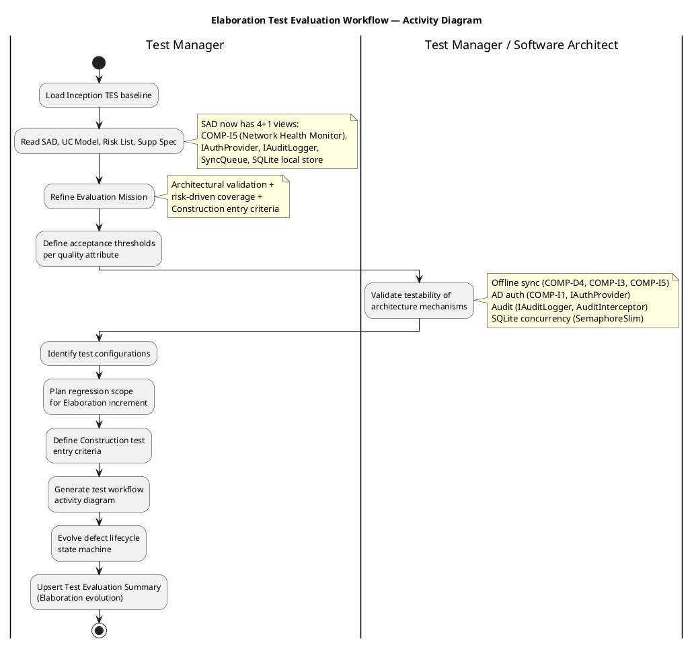
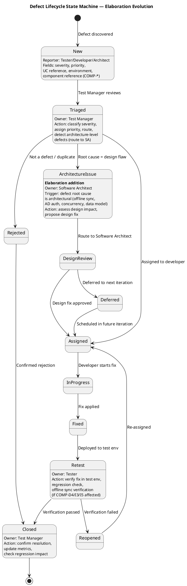

## Document Control

| Field | Value |
|---|---|
| Phase | Elaboration |
| Status | Draft |
| Iteration | 1 (Cycle 1) |
| Milestone Target | End of Elaboration (LCA) |
| Author | Test Manager |
| Prior Iteration | Inception 2 (LCO approved — GO verdict, 2026-07-07) |

## Test Scope

### Evaluation Mission

**Mission Statement:** Validate the architectural baseline's testability and define Construction-phase test entry criteria for the Employee Portal. The Elaboration test effort focuses on **architectural risk confrontation through test strategy** — verifying that the baseline architecture (SAD 4+1 views, Design Model classes, component contracts) is testable, that high-risk mechanisms (offline sync, AD auth, SQLite concurrency, audit trail) have defined test approaches, and that measurable acceptance thresholds are established for every quality attribute before Construction begins.

> **Evolution from Inception:** The Inception mission established the test strategy foundation (risk identification, UC coverage prioritization, defect lifecycle). The Elaboration mission **refines** that foundation with architectural testability validation, concrete acceptance thresholds, test environment configurations, and Construction entry criteria. No test execution occurs in Elaboration — this is a planning and validation mission.

**Objectives:**

1. **Validate architectural testability** — Confirm that each architecturally significant mechanism (offline sync via COMP-D4/COMP-I3/COMP-I5, AD auth via COMP-I1/IAuthProvider, audit via IAuditLogger/AuditInterceptor, SQLite concurrency via SemaphoreSlim) has a testable interface and defined test approach
2. **Define acceptance thresholds per quality attribute** — Translate NFRs (REQ-008, REQ-013, REQ-014, REQ-018, REQ-019) into measurable go/no-go test criteria
3. **Identify test configurations** — Define the environments, tools, and data required for Construction test execution
4. **Plan regression scope** — Identify which UCs and mechanisms require regression coverage per Construction iteration
5. **Define Construction test entry criteria** — Establish the conditions that must be met before test execution begins in Construction
6. **Evolve defect lifecycle** — Add architecture-level defect routing to the Inception defect state machine

**Scope Boundaries:**

- **In scope (Elaboration):** Architectural testability assessment, acceptance threshold definition, test environment planning, Construction entry criteria, regression scope planning, defect lifecycle evolution, risk-driven test approach for P1/P2 UCs
- **Out of scope (Elaboration):** Test case authoring, test execution, automated test framework implementation, performance/load testing execution, usability testing (all deferred to Construction)

### Elaboration Test Workflow

### Use Case Coverage Priorities (Elaboration Refinement)

Coverage priorities preserved from Inception baseline, refined with Elaboration architectural detail:

| UC ID | Use Case | Test Priority | Architectural Mechanism | Risk Driver | Elaboration Test Focus |
|---|---|---|---|---|---|
| UC-001 | Clock In/Out | **P1 — Critical** | Offline sync (COMP-D4, COMP-I3, COMP-I5), SyncQueue, SQLite local store | RISK-T01 (RPN 63), RISK-T03 (RPN 48), RISK-T06 | Testability of INetworkHealth interface; offline/online switching logic; data integrity verification approach; SQLite concurrency test design |
| UC-002 | View Clocking History | P2 — High | Reads from ClockingService (COMP-A1) | RISK-T03 | Data integrity test approach; read consistency after sync |
| UC-003 | Review and Export Clockings | P2 — High | CSV export (COMP-I4), role-based access | RISK-T04 | CSV format compliance test criteria; RBAC test approach |
| UC-004 | Publish News | P2 — High | AuditInterceptor (IAuditLogger), NewsService (COMP-A3) | RISK-T04 | Audit trail testability; audit log verification approach |
| UC-005 | Read News | P3 — Medium | NewsService (COMP-A3), caching | RISK-T04 | Performance threshold testability (page load <3s) |
| UC-006 | Search Directory | P2 — High | DirectoryService (COMP-A4), search query | RISK-T04, RISK-R01 | Search response time testability (≤2s per REQ-018); AD data mapping validation approach |
| UC-007 | Manage Directory | P2 — High | AD sync (COMP-I1, IAuthProvider), AuditInterceptor, override flag | RISK-T02 (RPN 35), RISK-R01 (RPN 30) | AD sync conflict test approach; override flag testability; audit trail verification |
| **ACT-003** | **AD Auth (cross-cutting)** | **P1 — Critical** | **IAuthProvider (COMP-I1), LDAP/OAuth2** | **RISK-T02** | **Test approach for AD integration: mock LDAP for unit tests, real AD for integration tests; fallback auth path coverage** |

### Acceptance Thresholds per Quality Attribute

| Quality Attribute | Requirement IDs | Threshold | Test Approach | Construction Entry Criterion |
|---|---|---|---|---|
| **Performance — Page Load** | REQ-019 | < 3 seconds (P95) | Load test with 50 concurrent users (REQ-025); measure via browser dev tools | Baseline measurement capability available |
| **Performance — Clock In/Out** | REQ-008 | < 1 second response | Load test during peak clock-in window; 50 concurrent users | Offline sync path instrumented for timing |
| **Performance — Directory Search** | REQ-018 | ≤ 2 seconds response | Search query test with 200-employee dataset | Test data fixture with 200 employee records prepared |
| **Availability** | REQ-013 | Mon–Fri 7:00–19:00; fault tolerance within corporate network | Uptime monitoring during test window; offline fault tolerance test (5-min network drop) | Offline test environment with network simulation capability |
| **Offline Fault Tolerance** | REQ-013, REQ-014 | 5-min network drop, zero data loss, auto-sync on restore | Network isolation test: disconnect PostgreSQL, perform clock in/out, reconnect, verify sync | SQLite local store test environment configured; INetworkHealth mock for controlled testing |
| **Audit Trail** | REQ-004, REQ-005, REQ-006 | Every news publish and directory change logged with user, timestamp, before/after values | Audit log verification after each UC-004/UC-007 operation | Audit log table accessible for query verification |
| **Security — AD Authentication** | REQ-001, REQ-002, REQ-003 | 100% sessions authenticated; RBAC for HR admin functions; no external network access | Auth bypass test; role escalation test; network binding verification | AD test environment or mock LDAP server available |
| **Data Integrity — Backup** | REQ-024, REQ-026, REQ-028 | Nightly pg_dump (30-day retention); WAL archiving RPO ≤15 min for clocking; monthly test-restore | Backup verification test; restore drill | PostgreSQL test instance with WAL archiving enabled |

### Test Configurations Required

| Configuration ID | Environment | Purpose | Components | Status |
|---|---|---|---|---|
| TC-ENV-01 | Development (local) | Unit testing, developer self-test | .NET 10, SQLite local store, xUnit/NUnit | ⚠️ Framework not yet selected — deferred to Construction |
| TC-ENV-02 | Integration (test server) | Integration testing, AD auth testing | .NET 10, PostgreSQL test DB, mock LDAP or test AD instance | ⚠️ AD test environment requires coordination with Miguel Torres |
| TC-ENV-03 | Offline simulation | Offline fault tolerance testing | .NET 10, SQLite local store, INetworkHealth mock, network isolation tooling | ⚠️ Network simulation approach needs SA input (PoC alignment) |
| TC-ENV-04 | Performance baseline | Load testing, response time measurement | .NET 10, PostgreSQL, 200-employee test data fixture, load testing tool | ⚠️ Load testing tool not yet selected — deferred to Construction |
| TC-ENV-05 | Staging (pre-production) | UAT, final regression | Windows Server, PostgreSQL, real AD (read-only test OU) | Deferred to Transition |

### Regression Scope Plan

| Construction Iteration | New Functionality | Regression Coverage | Rationale |
|---|---|---|---|
| Construction Iter 1 (UC-001) | Clock In/Out, offline sync, AD auth | N/A (first iteration) | Baseline — no prior functionality to regress |
| Construction Iter 2 (UC-002, UC-003) | View History, Export Clockings | UC-001 regression (clock in/out, offline sync, AD auth) | UC-002/003 depend on UC-001 data integrity |
| Construction Iter 3 (UC-004, UC-005) | Publish News, Read News | UC-001/002/003 regression + AD auth regression | News is independent but AD auth is cross-cutting |
| Construction Iter 4 (UC-006, UC-007) | Search Directory, Manage Directory | Full regression (all 7 UCs + AD auth + offline sync) | Final iteration — complete regression before LCA exit |

### Construction Test Entry Criteria

| Criterion | Status | Evidence |
|---|---|---|
| Architecture baseline validated (SAD 4+1 views) | ✅ Met | SAD Elaboration Draft with all 5 views, component contracts, ADRs |
| Design Model classes defined for all UCs | ✅ Met | Design Model Elaboration Draft with CLS-001 through CLS-017 |
| Test priorities assigned to all 7 UCs | ✅ Met | Coverage priority table above (P1-P3) |
| Acceptance thresholds defined per quality attribute | ✅ Met | 8 quality attributes with measurable thresholds |
| Test configurations identified | ⚠️ Partial | 5 configurations defined; AD test env and offline simulation need setup |
| Defect lifecycle published | ✅ Met | State machine with ArchitectureIssue routing (see below) |
| AD auth test approach defined | ✅ Met | Mock LDAP for unit tests; real AD for integration; fallback path coverage |
| Offline sync test approach defined | ✅ Met | INetworkHealth mock for controlled testing; data integrity verification after sync |
| Test data strategy defined | ⚠️ Partial | 200-employee fixture needed; AD schema mapping validation required |
| CI pipeline operational | ✅ Met | Build status: success on main (2026-07-07) |

## Test Summary

### Elaboration Test Status

No test execution occurs in Elaboration. This section documents the **architectural testability assessment** and **Construction readiness evaluation**.

| Assessment Area | Status | Notes |
|---|---|---|
| Architecture testability validated | ✅ Complete | All architecturally significant mechanisms (offline sync, AD auth, audit, concurrency) have testable interfaces: INetworkHealth, IAuthProvider, IAuditLogger |
| Acceptance thresholds defined | ✅ Complete | 8 quality attributes with measurable go/no-go criteria (see Acceptance Thresholds table) |
| Test configurations identified | ✅ Complete | 5 configurations defined (TC-ENV-01 through TC-ENV-05); 3 require setup action before Construction |
| Construction entry criteria defined | ✅ Complete | 10 criteria; 8 met, 2 partially met (AD test env, test data strategy) |
| Regression scope planned | ✅ Complete | Per-iteration regression coverage defined for all 4 Construction iterations |
| Defect lifecycle evolved | ✅ Complete | ArchitectureIssue state added for design-rooted defects; offline sync verification in Retest state |
| Risk-driven test approach | ✅ Complete | All High-magnitude risks (RPN > 35) have defined test mitigations |
| CI pipeline status | ✅ Green | Build success on main (2026-07-07 10:46:47Z); no test failures — bootstrap skeleton only |

### Architectural Mechanism Testability Assessment

| Mechanism | Component(s) | Interface | Testability | Test Approach |
|---|---|---|---|---|
| Offline sync | COMP-D4, COMP-I3, COMP-I5 | INetworkHealth | ✅ High — interface allows mock injection | Mock INetworkHealth to simulate network drop/restore; verify SyncQueue processes queued entries; verify zero data loss |
| AD authentication | COMP-I1 | IAuthProvider | ✅ High — interface allows mock injection | Mock IAuthProvider for unit tests; real AD/LDAP for integration tests; test fallback auth path |
| Audit trail | AuditInterceptor | IAuditLogger | ✅ High — interface allows mock injection | Mock IAuditLogger to verify log entries; query audit table for integration tests |
| SQLite concurrency | SyncQueue (local store) | (internal) | ⚠️ Medium — SemaphoreSlim is internal; requires integration test | Load test with concurrent clock in/out operations during offline mode; verify no deadlocks or data corruption |
| CSV export | COMP-I4 | (service) | ✅ High — pure function testable in isolation | Unit test with known input data; verify RFC 4180 compliance; verify date/time formatting |
| Data sync conflict | SyncQueue, override flag | (internal) | ⚠️ Medium — requires integration test with AD | Test override flag scenario (UC-007 S3); verify audit trail logs override; verify AD sync does not overwrite flagged fields |

### CI Build Status (Real SCM Data)

| Metric | Value | Source |
|---|---|---|
| Latest build status | **Success** | scm_get_build_status (2026-07-07) |
| Branch | main | — |
| Build started | 2026-07-07 10:46:13Z | — |
| Build completed | 2026-07-07 10:46:47Z | — |
| Build duration | 34 seconds | — |
| Test results | N/A — bootstrap skeleton, no functional tests yet | — |

> **Note:** The CI pipeline is green on the bootstrap skeleton. No functional code has been produced in Elaboration (architecture and design phase). Test execution will activate in Construction iteration 1 when UC-001 implementation begins.

## Defects and Incidents

### Defect Lifecycle (Elaboration Evolution)

The defect lifecycle state machine has been evolved from the Inception baseline to add an **ArchitectureIssue** state for defects whose root cause is a design flaw rather than a code bug. This is critical in Elaboration where architectural defects are most likely to be discovered.

### Defect Severity Classification (Preserved from Inception)

| Severity | Definition | SLA Target |
|---|---|---|
| **Critical (S1)** | System unusable; data loss; offline sync failure; auth bypass | Fix within current iteration |
| **High (S2)** | Core function broken but workaround exists; performance threshold exceeded by >50% | Fix within next iteration |
| **Medium (S3)** | Non-core function broken; cosmetic issues on key pages | Fix within 2 iterations |
| **Low (S4)** | Minor cosmetic; documentation; non-user-facing | Fix when capacity allows |

### SCM Issue Tracker Status (Real Data)

| Issue # | Title | Labels | Severity | Status | Test Relevance |
|---|---|---|---|---|---|
| #1 (CR-001) | Update Vision Document Control iteration marker (deferred F6) | change-request, priority:low, severity:minor | S4 — Low | Open | Documentation only — no test impact |
| #2 (CR-002) | Update Iteration Assessment objective statuses (deferred F7) | change-request, priority:low, severity:minor | S4 — Low | Open | Documentation only — no test impact |
| #3 (CR-003) | Formalize design file impact assessment from stakeholder input (S2) | change-request, severity:major, impact:architectural | S2 — High | Open | **Architecture-level** — if design file changes affect component contracts, regression scope may need update. Route via ArchitectureIssue state if design rework is needed. |

> **Assessment:** 3 open change requests, none are code defects (no functional code produced yet). CR-003 is architecturally significant and should be monitored — if it triggers design changes, the test approach for affected components (COMP-P1 through COMP-P4) must be re-evaluated.

### Elaboration Defect Metrics

No code defects reported in Elaboration — architecture and design phase only. The CI pipeline is green on the bootstrap skeleton. Defect tracking will activate in Construction iteration 1 when UC-001 implementation begins. The 3 open SCM issues are change requests from Inception review findings, not code defects.

## Conclusions

### Evaluation Mission Verdict

**Status: MISSION MET — Elaboration test strategy validated, Construction entry criteria defined**

The Elaboration Evaluation Mission aimed to validate architectural testability and define Construction-phase test entry criteria. The following objectives were achieved:

| Objective | Status | Evidence |
|---|---|---|
| Validate architectural testability | ✅ Met | 6 mechanisms assessed; 4 High testability (interface-isolated), 2 Medium (require integration tests); all have defined test approaches |
| Define acceptance thresholds per quality attribute | ✅ Met | 8 quality attributes with measurable thresholds; all trace to Supplementary Spec REQs |
| Identify test configurations | ✅ Met | 5 configurations defined (TC-ENV-01 through TC-ENV-05); 3 require setup action before Construction |
| Plan regression scope | ✅ Met | Per-iteration regression coverage for all 4 Construction iterations; bottom-up integration order respected |
| Define Construction test entry criteria | ✅ Met | 10 criteria defined; 8 met, 2 partially met (AD test env, test data strategy) |
| Evolve defect lifecycle | ✅ Met | ArchitectureIssue state added; offline sync verification in Retest; component reference in New state |

### Open Items Requiring Action Before Construction

| Item | Owner | Action | Risk if Unresolved |
|---|---|---|---|
| AD test environment | Test Manager + Miguel Torres | Establish test AD instance or mock LDAP server on integration test server | AD auth integration tests blocked; RISK-T02 mitigation delayed |
| Offline test simulation | Test Manager + Software Architect | Define network simulation approach aligned with PoC plan (INetworkHealth mock) | Offline sync tests blocked; RISK-T01 mitigation delayed |
| Test data fixture | Test Designer | Create 200-employee test data fixture with AD schema mapping | Performance and directory search tests blocked |
| Test framework selection | Test Designer | Select xUnit or NUnit; define test project structure | Unit test authoring blocked in Construction iter 1 |
| Load testing tool | Test Designer | Select load testing tool (k6, JMeter, or similar) | Performance baseline testing blocked |

### Recommendations for Construction

1. **UC-001 test cases first** — Begin test case design for UC-001 (Clock In/Out) in Construction iteration 1; include offline sync scenarios (5-min network drop, data integrity verification, auto-sync on restore) and AD auth validation via ACT-003 `<<include>>`
2. **AD auth as cross-cutting test concern** — Every UC test scenario must include AD auth validation; use mock IAuthProvider for unit tests, real AD for integration tests
3. **Offline sync test design** — Use INetworkHealth mock to simulate network drop/restore; verify SyncQueue processes all queued entries; verify zero data loss; test concurrent clock in/out during offline mode (RISK-T06)
4. **Performance baseline early** — Establish baseline measurements for page load and clock in/out response times as soon as UC-001 prototype is functional; compare against thresholds (REQ-008, REQ-019)
5. **Regression from iteration 2** — Begin regression testing from Construction iteration 2; first regression covers UC-001 (clock in/out, offline sync, AD auth)
6. **Monitor CR-003** — If the design file assessment (CR-003) triggers architectural changes, re-evaluate test approach for affected components; route via ArchitectureIssue defect state

### Acceptance Criteria Traceability (Elaboration Update)

| Acceptance Criterion | Test Coverage Plan | Quality Attribute | Phase | Status |
|---|---|---|---|---|
| Employee clocks in/out without HR help | UC-001 P1 test cases; usability testing; AD auth via ACT-003 `<<include>>` | Usability, Functional | Construction | Test approach defined |
| HR publishes news without technical assistance | UC-004 P2 test cases; usability testing; AD auth via ACT-003 `<<include>>` | Usability, Functional | Construction | Test approach defined |
| Employee finds colleague in <10 seconds | UC-006 P2 test cases; performance test (REQ-008, REQ-018 ≤2s search) | Performance | Construction | Threshold defined; test data fixture needed |
| 80% complete clocking with no training | UC-001 P1 usability test; user acceptance testing; AD auth via ACT-003 `<<include>>` | Usability | Transition | Test approach defined |
| System works offline 5 min, syncs on restore | UC-001 P1 offline test scenario; INetworkHealth mock; RISK-T01 mitigation; zero data loss verification | Availability, Reliability | Construction | Test approach defined; offline simulation env needed |

## Traceability

| Element | Traces From | Link Type | Traces To |
|---|---|---|---|
| TES-001 (Evaluation Mission) | Vision, Risk List, SAD (Elaboration), UC Model (Elaboration) | Derives | Construction Test Cases (TC-001 through TC-007) |
| TES-002 (UC Coverage Priorities) | UC-001 through UC-007, ACT-003, RISK-T01, RISK-T02, RISK-T03, RISK-T06 | Derives | TC-001 through TC-007 (future, Construction) |
| TES-003 (Testing Risks) | RISK-T01 (RPN 63), RISK-T02 (RPN 35), RISK-T03 (RPN 48), RISK-T04 (RPN 30), RISK-R01 (RPN 30), RISK-T06 | Derives | Construction Test Cases, Performance Test Plan |
| TES-004 (Defect Lifecycle) | SCM Issue Tracker, Inception TES-004 | DependsOn | All Construction test execution |
| TES-005 (Test Strategy by Phase) | Vision (acceptance criteria), Supplementary Spec (REQ-001 through REQ-029), SAD (4+1 views) | Derives | Construction/Transition test execution |
| TES-006 (Acceptance Criteria Mapping) | Vision (5 acceptance criteria), REQ-008, REQ-013, REQ-014, REQ-018, REQ-019 | Derives | User Acceptance Testing (Transition) |
| TES-007 (AD Auth Cross-Cutting Strategy) | ACT-003, REQ-001, REQ-002, REQ-003, COMP-I1, IAuthProvider | Derives | All UC test scenarios (TC-001 through TC-007) |
| TES-008 (Acceptance Thresholds) | REQ-004, REQ-005, REQ-006, REQ-008, REQ-013, REQ-014, REQ-018, REQ-019, REQ-024, REQ-026 | Derives | Construction performance tests, audit verification tests |
| TES-009 (Test Configurations) | SAD (Deployment View), CON-004 (AD), CON-005 (internal server), REQ-025 (50 concurrent users) | Derives | Construction test environment setup |
| TES-010 (Regression Scope) | SAD (Integration Order), Iteration Plan (Construction schedule), UC-001 through UC-007 | Derives | Construction iteration regression test plans |
| TES-011 (Construction Entry Criteria) | SAD (baseline), Design Model (classes), CI pipeline (build status) | Derives | Construction iteration 1 test kickoff |
| TES-012 (Architectural Testability) | SAD (COMP-D4, COMP-I1, COMP-I3, COMP-I5, IAuthProvider, INetworkHealth, IAuditLogger) | Derives | Construction integration test design |
| TES-013 (Defect Lifecycle Evolution) | Inception TES-004, SAD (architecture mechanisms) | Refines | Construction defect tracking process |
| TES-014 (SCM Quality Intelligence) | scm_get_build_status (success, 2026-07-07), scm_list_issues (3 open CRs) | DependsOn | Construction defect metrics baseline |