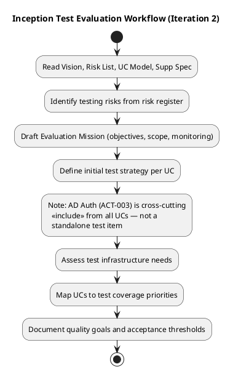
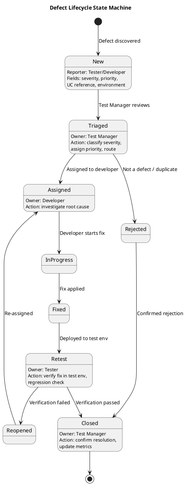

## Document Control
| Field | Value |
|---|---|
| Phase | Inception |
| Status | Draft |
| Iteration | 2 (Cycle 1) |
| Milestone Target | End of Inception (LCO) |
| Author | Test Manager |
## Test Scope
### Evaluation Mission

**Mission Statement:** Establish the test strategy foundation for the Employee Portal by identifying quality risks, defining test coverage priorities against the 7 use cases, and setting the initial evaluation criteria that will govern each subsequent iteration's test effort. The Inception test effort focuses on **risk identification and strategy formulation** — not test execution.

> **Iteration 2 Update (F4 Resolution):** AD Authentication is no longer a standalone use case. Per UC Model iteration 2 rework (F3 resolved), AD Authentication is modeled as external system actor **ACT-003** with `<<include>>` from all UCs. AD auth testing is therefore a **cross-cutting test concern** integrated into every UC test scenario, not a separate test item. Requirements REQ-001 through REQ-003 in the Supplementary Specification govern AD auth test coverage.

**Objectives:**
1. Identify and prioritize testing risks derived from the project Risk List and Supplementary Specification
2. Map each use case to a test coverage priority based on architectural significance and risk
3. Define the initial test strategy: what will be tested, how, and with what infrastructure
4. Establish order-of-magnitude effort estimates for test activities across phases
5. Define the defect lifecycle that will govern issue tracking via SCM
6. Identify AD authentication (ACT-003) as a cross-cutting test concern across all UC scenarios

**Scope Boundaries:**
- **In scope:** Test strategy definition, risk-based coverage prioritization, infrastructure assessment, defect lifecycle definition, cross-cutting AD auth test strategy
- **Out of scope (Inception):** Test case authoring, test execution, automated test framework setup, performance/load testing, detailed acceptance thresholds (deferred to Elaboration)

### Inception Test Workflow

### Use Case Coverage Priorities

Coverage priority is assigned based on architectural significance, risk priority number (RPN), and stakeholder acceptance criteria. AD Authentication (ACT-003) is a cross-cutting concern tested via `<<include>>` from all UCs — it does not have its own coverage row.

| UC ID | Use Case | Test Priority | Rationale |
|---|---|---|---|
| UC-001 | Clock In/Out | **P1 — Critical** | Architecturally significant (offline fault tolerance); RISK-T01 (RPN 63); acceptance criteria: clock in/out without help, 80% adoption, offline sync; AD auth via `<<include>>` ACT-003 |
| UC-002 | View Clocking History | P2 — High | Depends on UC-001 data integrity; employee self-service; AD auth via `<<include>>` ACT-003 |
| UC-003 | Review and Export Clockings | P2 — High | HR reporting function; CSV format compliance (RFC 4180); role-based access (REQ-002); AD auth via `<<include>>` ACT-003 |
| UC-004 | Publish News | P2 — High | Audit trail requirement (REQ-004, REQ-006); HR admin function; AD auth via `<<include>>` ACT-003 |
| UC-005 | Read News | P3 — Medium | Read-only employee function; performance threshold (REQ-019); AD auth via `<<include>>` ACT-003 |
| UC-006 | Search Directory | P2 — High | Acceptance criterion: find colleague in <10 seconds (REQ-008); performance threshold (REQ-018); AD auth via `<<include>>` ACT-003 |
| UC-007 | Manage Directory | P2 — High | Audit trail (REQ-005, REQ-006); AD sync conflict handling (RISK-R01); AD auth via `<<include>>` ACT-003 |
| **ACT-003** | **Active Directory (cross-cutting)** | **P1 — Critical (cross-cutting)** | **AD auth is `<<include>>` from all 7 UCs; test coverage integrated into every UC scenario; standalone AD integration test in Elaboration (RISK-T02 mitigation)** |

### Testing Risks Identified

| Risk ID | Source | Testing Implication | Mitigation |
|---|---|---|---|
| RISK-T01 | Offline fault tolerance (RPN 63) | Hardest to test — requires network simulation; data integrity verification after sync | Plan dedicated offline test scenario in Elaboration; coordinate with SA on PoC |
| RISK-T03 | Sync conflict (RPN 48) | Concurrent clock entries during offline period may conflict on restore | Design conflict-resolution test cases in Elaboration |
| RISK-T02 | AD integration (RPN 35) | Auth testing requires AD test environment or mock; cross-cutting across all UCs (ACT-003 `<<include>>`); fallback auth path needs coverage | Early spike with Miguel Torres; plan AD integration test in Elaboration; test AD auth within each UC scenario |
| RISK-T04 | Performance (RPN 30) | Load testing for 200 concurrent users; page load <3s, clock <1s | Performance test plan in Construction; baseline measurements in Elaboration |
| RISK-S02 | Adoption (RPN 24) | Usability testing for zero-training clock in/out | Usability test scenario in Construction; acceptance criterion: 80% complete clocking with no training |
| RISK-R01 | AD data mapping (RPN 30) | Directory data accuracy depends on AD sync; test data must reflect real AD schema | Coordinate test data with Miguel Torres; validate field mapping in Elaboration |

### Initial Test Strategy by Phase

| Phase | Test Activities | Effort Estimate |
|---|---|---|
| **Inception** (current) | Risk identification, strategy definition, coverage prioritization, defect lifecycle, cross-cutting AD auth test strategy | ~5% of total test effort |
| **Elaboration** | Test architecture, AD integration spike testing (ACT-003 cross-cutting), offline PoC test support, test environment setup, initial test case design for P1 UCs | ~20% of total test effort |
| **Construction** | Test case authoring (all UCs), test execution, regression testing per iteration, performance testing, usability testing, integration testing, AD auth regression per UC | ~60% of total test effort |
| **Transition** | System acceptance testing, deployment verification, user acceptance testing with HR Director, final regression | ~15% of total test effort |

### Quality Goals (Inception)

| Goal | Measure | Target |
|---|---|---|
| Risk coverage | All High-magnitude risks (RPN > 35) have a testing mitigation plan | 100% by end of Inception |
| UC coverage mapping | Every UC assigned a test priority | 7/7 UCs mapped |
| AD auth coverage | AD auth (ACT-003) test strategy defined as cross-cutting concern across all UCs | Strategy documented |
| Test strategy alignment | Strategy traces to Vision acceptance criteria and Supplementary Spec REQs | All 5 acceptance criteria addressed |
| Defect lifecycle | Formal lifecycle defined and agreed | State machine published |
## Test Summary

### Inception Test Status

No test execution occurs in Inception. This section documents the **readiness assessment** for entering Elaboration testing.

| Assessment Area | Status | Notes |
|---|---|---|
| Test strategy defined | ✅ Complete | Risk-based prioritization across 7 UCs |
| Test infrastructure assessed | ⚠️ Partial | AD test environment needs confirmed; offline test scenario requires network simulation tooling (deferred to Elaboration) |
| Test environment requirements identified | ✅ Complete | See Environmental Needs below |
| Defect tracking process defined | ✅ Complete | SCM issue tracker; state machine published |
| Test effort estimated | ✅ Complete | Order-of-magnitude: ~30-40% of total project effort |

### Entry Criteria for Elaboration Testing

1. ✅ Vision, Risk List, Use-Case Model, and Supplementary Specification available (all in Draft status)
2. ✅ Test coverage priorities assigned to all 7 UCs
3. ⚠️ AD test environment availability — requires coordination with Miguel Torres
4. ⚠️ Offline test scenario design — requires SA PoC architecture (RISK-T01 mitigation)

## Defects and Incidents

### Defect Lifecycle

Defects are tracked via the SCM issue tracker (GitHub Issues). The following state machine governs the defect lifecycle:

### Defect Severity Classification

| Severity | Definition | SLA Target |
|---|---|---|
| **Critical (S1)** | System unusable; data loss; offline sync failure; auth bypass | Fix within current iteration |
| **High (S2)** | Core function broken but workaround exists; performance threshold exceeded by >50% | Fix within next iteration |
| **Medium (S3)** | Non-core function broken; cosmetic issues on key pages | Fix within 2 iterations |
| **Low (S4)** | Minor cosmetic; documentation; non-user-facing | Fix when capacity allows |

### Inception Defect Metrics

No defects reported in Inception — no code has been produced yet. The CI pipeline is green on the bootstrap skeleton (per project context). Defect tracking will activate in Elaboration when the first functional code is tested.

## Conclusions

### Evaluation Mission Verdict

**Status: MISSION PARTIALLY MET — proceeding to Elaboration**

The Inception Evaluation Mission aimed to establish the test strategy foundation. The following objectives were achieved:

| Objective | Status | Evidence |
|---|---|---|
| Identify testing risks | ✅ Met | 6 testing risks identified from Risk List, mapped to mitigations |
| Map UCs to test priorities | ✅ Met | All 7 UCs assigned P1-P3 priorities with rationale |
| Define initial test strategy | ✅ Met | Phase-based strategy with effort estimates |
| Assess test infrastructure | ⚠️ Partially Met | Core needs identified; AD test env and offline simulation deferred to Elaboration |
| Define defect lifecycle | ✅ Met | State machine published; severity classification defined |

### Recommendations for Elaboration

1. **AD Test Environment:** Coordinate with Miguel Torres to establish a test AD instance or mock LDAP server for integration testing (RISK-T02 mitigation)
2. **Offline Test Scenario:** Collaborate with Software Architect on the offline PoC to define testable acceptance criteria for the 5-minute network drop scenario (RISK-T01 mitigation)
3. **Test Case Design:** Begin detailed test case design for UC-001 (P1) in early Elaboration
4. **Performance Baseline:** Establish baseline measurements for page load and clock in/out response times once the first functional prototype is available
5. **Test Data Strategy:** Define test data requirements for 200-employee simulation, including AD schema mapping validation

### Acceptance Criteria Traceability

| Acceptance Criterion | Test Coverage Plan | Phase |
|---|---|---|
| Employee clocks in/out without HR help | UC-001 P1 test cases; usability testing | Construction |
| HR publishes news without technical assistance | UC-004 P2 test cases; usability testing | Construction |
| Employee finds colleague in <10 seconds | UC-006 P2 test cases; performance test (REQ-008, REQ-018) | Construction |
| 80% complete clocking with no training | UC-001 P1 usability test; user acceptance testing | Transition |
| System works offline 5 min, syncs on restore | UC-001 P1 offline test scenario; RISK-T01 mitigation | Elaboration (PoC) + Construction |

## Traceability

| Element | Traces From | Link Type | Traces To |
|---|---|---|---|
| TES-001 (Evaluation Mission) | Vision, Risk List | Derives | Iteration Plan (Elaboration test scope) |
| TES-002 (UC Coverage Priorities) | UC-001 through UC-007, RISK-T01, RISK-T03, RISK-T04 | Derives | TC-001 through TC-007 (future, Elaboration) |
| TES-003 (Testing Risks) | RISK-T01, RISK-T02, RISK-T03, RISK-T04, RISK-R01, RISK-S02 | Derives | Elaboration Test Plan, Construction Test Cases |
| TES-004 (Defect Lifecycle) | SCM Issue Tracker | DependsOn | All future test execution |
| TES-005 (Test Strategy by Phase) | Vision (acceptance criteria), Supplementary Spec (REQ-001 through REQ-023) | Derives | Elaboration/Construction/Transition test plans |
| TES-006 (Acceptance Criteria Mapping) | Vision (5 acceptance criteria), REQ-008, REQ-009, REQ-013, REQ-014, REQ-016, REQ-017 | Derives | User Acceptance Testing (Transition) |